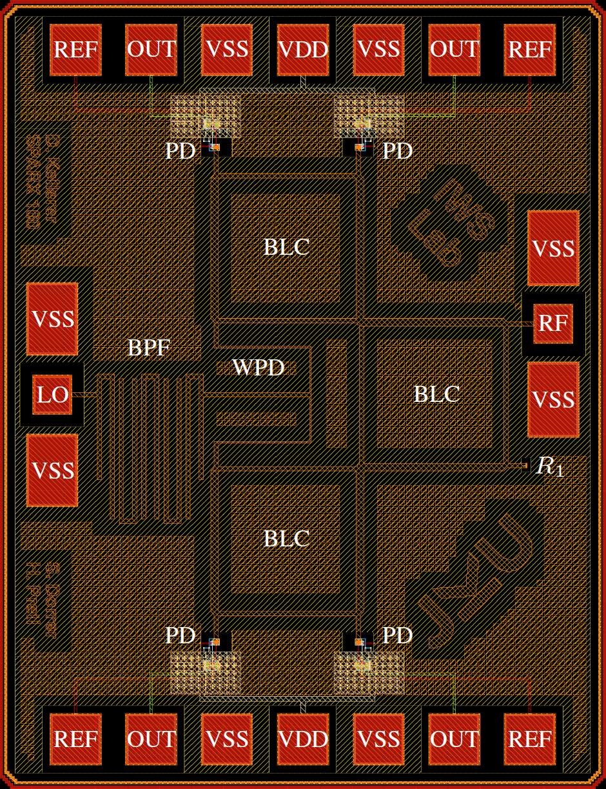
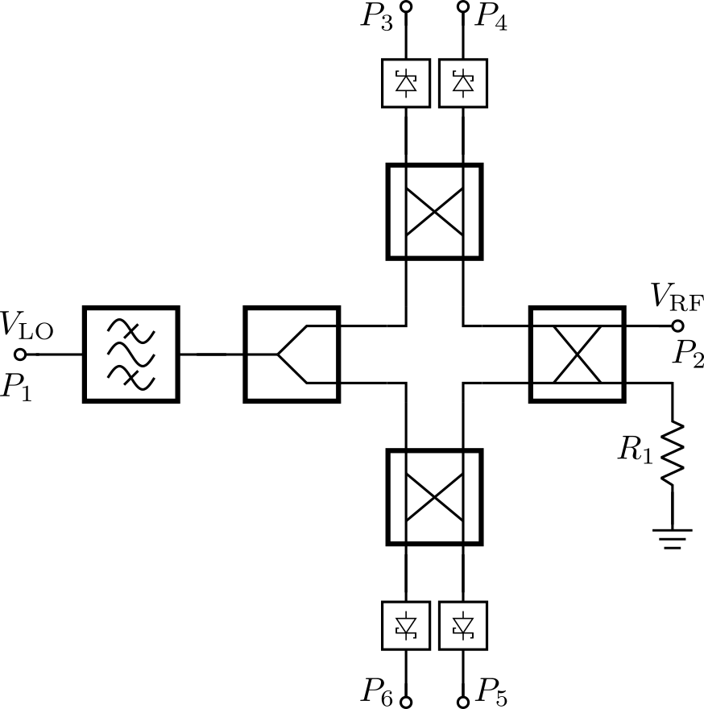
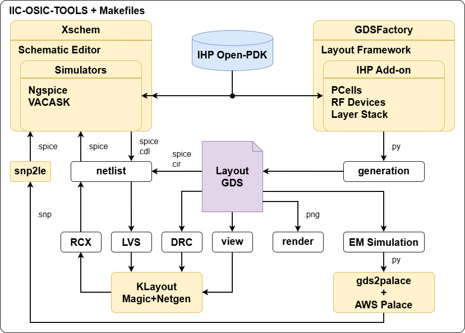

# SPARX: An Open-Source, Automated, Programmatically Generated, Frequency-Scalable Six-Port Receiver in 130-nm CMOS

[](LICENSE)
[](https://github.com/iic-jku/SG13CMOS_SPARX/actions/workflows/quarto-publish.yml)
[](https://github.com/iic-jku/SG13CMOS_SPARX/actions/workflows/regression.yml)
[](https://github.com/iic-jku/SG13CMOS_SPARX/actions/workflows/license-check.yml)
[](https://iic-jku.github.io/SG13CMOS_SPARX/index.html)
[](https://doi.org/10.5281/zenodo.19654232)

(c) 2025-2026 Simon Dorrer, David Kellerer-Pirklbauer, and Harald Pretl

Institute for Integrated Circuits and Quantum Computing, Johannes Kepler University (JKU), Linz, Austria

> [!IMPORTANT]
> This repository requires the [IIC-OSIC-TOOLS](https://github.com/iic-jku/IIC-OSIC-TOOLS) container with tag `2026.07` or later.

> [!TIP]
> This repository is based on the [ihp-sg13g2-ams-chip-template](https://github.com/iic-jku/ihp-sg13g2-ams-chip-template) template repository and has been extended with electromagnetic (EM) simulations using the tool AWS Palace. For a better understanding of the folder structure, how to use the Makefiles, and how to implement your own designs, it is recommended to go through this [tutorial](https://iic-jku.github.io/ihp-sg13g2-ams-chip-template/index.html).

> [!NOTE]
> SPARX stands for **S**ix-**P**ort **A**utomated Receiver (**RX**). The name also carries a subtle double meaning: *SPARX* sounds like *spark*, which translates to *Funken* in German. Fittingly, the German verb *funken* also means to communicate via radio, a subtle nod to the wireless world this receiver was designed for.

<p align="center">
  <a href="doc/fig/sparx160/sparx160_top_black_pinout.png">
    
  </a>
  <br>
  <em>Chip render of the ihp-sg13cmos six-port receiver for 160 GHz with M5 GND plane and pinout (1 mm × 1.4 mm).</em>
</p>


## Chip Specifications

| Parameter           | Value                                                                             |
| ------------------- | --------------------------------------------------------------------------------- |
| Technology          | IHP SG13CMOS (130 nm CMOS)                                                          |
| Die Area            | 1000 × 1400 µm (1.4 mm²)                                                          |
| Supply Voltage      | 1.5 V                                                                             |


## Documentation

> [!IMPORTANT]
> This work has been submitted to the IEEE for possible publication. Copyright may be transferred without notice, after which this version may no longer be accessible.

The full documentation of SPARX is available [here](https://iic-jku.github.io/SG13CMOS_SPARX/index.html) (WIP).


## Overview

The complete layout is generated in Python using self-made RF devices as a GDSFactory IHP PDK add-on. S-parameter simulation of the passive RF structures (BPF, WPD, and BLC) is performed with AWS Palace. The de-embedded EM results are then fitted to passivity-enforced lumped element models with [snp2le](https://github.com/iic-jku/snp2le), in both SPICE and Spectre dialects, and resimulated in Xschem testbenches with ngspice and VACASK. The six-port core is verified in two ways: as a single fitted model of the full-core EM simulation and as a composition of the individual BPF, WPD, and BLC models. With KLayout, Magic, and Netgen, a complete LVS, DRC, and PEX verification flow is implemented. The SBD-based power detector is designed in Xschem and simulated with ngspice and VACASK. This repository is controlled by a Makefile. Just clone it and run `make all` to build the six-port receiver at 160 GHz, verify it, run the EM simulations, extract the lumped element models, and simulate all testbenches. To generate a frequency-scalable layout at a different target frequency, for example 77 GHz, run `make build-layout FREQ=77`. A nightly [regression](#regression) exercises the complete tool flow in GitHub Actions inside the IIC-OSIC-TOOLS container. The following video demonstrates the generation of six-port receivers from 60 GHz to 300 GHz in under one minute.

**Index Terms:** Branch-line coupler, frequency-scalable layout, GDSFactory, hairpin coupled-line bandpass filter, IHP Open-PDK, mmWave, open-source EDA, power detector, programmatic layout, Schottky barrier diode, six-port receiver, Wilkinson power divider.

https://github.com/user-attachments/assets/a1e6cacb-4a70-4f2c-9b7a-f4b6fbb5a47a
<p align="center">
  <em>Generation of Six-Port Receivers from 60 GHz to 300 GHz.</em>
</p>


## References
To understand the principle of six-port receivers and their architectures, it is recommended to read the following references:
- A. Koelpin, G. Vinci, B. Laemmle, D. Kissinger and R. Weigel, "The Six-Port in Modern Society," in IEEE Microwave Magazine, vol. 11, no. 7, pp. 35-43, Dec. 2010, doi: 10.1109/MMM.2010.938584: https://ieeexplore.ieee.org/document/5590352
- T. Hentschel, "The six-port as a communications receiver," in IEEE Transactions on Microwave Theory and Techniques, vol. 53, no. 3, pp. 1039-1047, March 2005, doi: 10.1109/TMTT.2005.843507: https://ieeexplore.ieee.org/document/1406309
- M. Mailand, "System Analysis of Six-Port-Based RF-Receivers," in IEEE Transactions on Circuits and Systems I: Regular Papers, vol. 65, no. 1, pp. 319-330, Jan. 2018, doi: 10.1109/TCSI.2017.2734922: https://ieeexplore.ieee.org/document/8011483


## Requirements

To build this six-port receiver, the following tools and their respective dependencies are required:
- GDSFactory: https://github.com/gdsfactory/gdsfactory
- IHP Open-PDK GDSFactory Addon: https://github.com/iic-jku/IHP-GDSFactory-Addon
- IHP Open-PDK: https://github.com/iic-jku/IHP-Open-PDK
- snp2le (S-parameter to lumped element netlist conversion): https://github.com/iic-jku/snp2le, available on PyPI: https://pypi.org/project/snp2le/

GDSFactory, the IHP Open-PDK, and snp2le are already installed in the IIC-OSIC-TOOLS container.

The updated IHP Open-PDK GDSFactory version contains all self-made RF devices and wraps existing PCells provided by the IHP Open-PDK, allowing them to be used directly within the GDSFactory framework. We choose this approach because it requires very little maintenance. If IHP changes the layout of a cell, no wrapper update is necessary. Only interface changes to a PCell function require updates on our side.


## Block Diagram
- Six-Port
  - Branch Line Coupler (BLC)
  - Wilkinson Power Divider (WPD)
  - Hairpin Coupled-Line Bandpass Filter (BPF)
- Power Detector (PD)
  - Schottky Barrier Diode (SBD)
- Metal Stack
  - TopMetal2 (TM2): RF traces
  - Metal5 (M5): GND plane

<p align="center">
  <a href="doc/fig/sparx_blockdiagram/sparx_blockdiagram.png">
    
  </a>
  <br>
  <em>Block diagram of the six-port receiver.</em>
</p>


## Schematic of SBD-based Power Detector

<p align="center">
  <a href="doc/fig/sparx_powdet_sbd/sparx_powdet_sbd_circuit.png">
    
  </a>
  <br>
  <em>Schematic of the SBD-based power detector with replica circuit for fully-differential measurements. The supply and bias voltages are decoupled on-chip by MIM capacitors. The filtering capacitor is placed off-chip.</em>
</p>


## Design Flow

An overview of the open-source design flow for SPARX is shown below. The flow covers schematic entry, circuit simulation, parameterized layout generation, physical verification, post-layout simulation, EM simulation and resimulation of fitted lumped element models. All required tools and the IHP Open-PDK run inside the IIC-OSIC-TOOLS Docker image. The complete design flow is automated with Makefile targets, which are explained below.

<p align="center">
  <a href="doc/fig/design_flow/design_flow.png">
    
  </a>
  <br>
  <em>Overview of the open-source design flow for SPARX.</em>
</p>


## Directory Structure

```text
📁 SG13CMOS_SPARX/
├─ 📁 .github/
│  └─ 📁 workflows/
│     ├─ license-check.yml
│     ├─ quarto-publish.yml
│     └─ regression.yml
├─ 📁 doc/
│  ├─ 📁 fig/
│  ├─ 📁 videos/
│  ├─ _quarto.yml
│  ├─ index.qmd
│  ├─ requirements.txt
│  └─ Makefile
├─ 📁 LICENSES/
│  ├─ Apache-2.0.txt
│  └─ SHL-2.1.txt
├─ 📁 layout/
│  ├─ sparx60_top.gds
│  ├─ ...
│  ├─ sparx160_top.gds
│  ├─ ...
│  ├─ sparx300_top.gds
│  └─ sparx_powdet_sbd.gds
├─ 📁 measurements/
├─ 📁 netlist/
│  ├─ 📁 layout/
│  │  ├─ sparx_powdet_sbd_klayout.cir
│  │  └─ sparx_powdet_sbd_magic.ext.spc
│  ├─ 📁 pex/
│  │  ├─ sparx_powdet_sbd_klayout_pex.spice
│  │  └─ sparx_powdet_sbd_magic_pex.spice
│  ├─ 📁 schematic/
│  │  ├─ sparx_powdet_sbd_klayout.cdl
│  │  └─ sparx_powdet_sbd_magic.spice
│  ├─ 📁 spectre/
│  │  ├─ sparx_blc_le.inc
│  │  ├─ sparx_bpf_le.inc
│  │  ├─ sparx_core_le.inc
│  │  └─ sparx_wpd_le.inc
│  └─ 📁 spice/
│     ├─ sparx_blc_le.spice
│     ├─ sparx_bpf_le.spice
│     ├─ sparx_core_le.spice
│     └─ sparx_wpd_le.spice
├─ 📁 release/
│  └─ 📁 v.1.0.0/
│     ├─ 📁 gds/
│     ├─ 📁 img/
│     └─ ReleaseNote.md
├─ 📁 render/
│  ├─ 📁 blender/
│  └─ 📁 img/
│     ├─ sparx160_top_black.png
│     └─ sparx160_top_white.png
├─ 📁 schematic/
│  ├─ sparx_blc_le.sym
│  ├─ sparx_bpf_le.sym
│  ├─ sparx_core.sch
│  ├─ sparx_core.sym
│  ├─ sparx_core_le.sym
│  ├─ sparx_powdet_sbd.sch
│  ├─ sparx_powdet_sbd.sym
│  ├─ sparx_powdet_sbd_pex.sym
│  ├─ sparx_top.sch
│  ├─ sparx_top.sym
│  ├─ sparx_top_lvs.sch
│  ├─ sparx_wpd_le.sym
│  └─ xschemrc
├─ 📁 scripts/
│  ├─ 📁 assets/
│  ├─ lay2img.py
│  ├─ make_gds.py
│  ├─ six_port_gen.py
│  └─ sparx_powdet_sbd_circuit.ipynb
├─ 📁 sscs-ose-code-a-chip/
│  ├─ 📁 assets/
│  ├─ README.md
│  └─ SPARX_JKU_VLSI2026.ipynb
├─ 📁 testbenches/
│  ├─ 📁 plot_simulations/
│  │  ├─ 📁 data/
│  │  ├─ 📁 figures/
│  │  ├─ ngspice2python.py
│  │  ├─ plot_n_port_tb_acsp_ngspice.py
│  │  ├─ plot_n_port_tb_acsp_vacask.py
│  │  ├─ plot_n_port_tb_tran_ngspice.py
│  │  ├─ plot_sparx_powdet_sbd_tb_hb_V-W_vacask.py
│  │  └─ plot_sparx_powdet_sbd_tb_hb_dBV-dBV_vacask.py
│  ├─ sparx_blc_le_tb_acsp_ngspice.sch
│  ├─ ...
│  ├─ sparx_core_tb_acsp_ngspice.sch
│  ├─ ...
│  ├─ sparx_powdet_sbd_tb_ngspice.sch
│  ├─ ...
│  ├─ sparx_top_tb_tran_ngspice.sch
│  ├─ sim_range.inc
│  ├─ sim_range.spice
│  └─ xschemrc
├─ 📁 verification/
│  ├─ 📁 drc/
│  │  ├─ 📁 sparx160_top.klayout.drc/
│  │  ├─ 📁 sparx160_top.magic.drc/
│  │  ├─ 📁 sparx_powdet_sbd.klayout.drc/
│  │  └─ 📁 sparx_powdet_sbd.magic.drc/
│  ├─ 📁 em/
│  │  ├─ 📁 layout/
│  │  ├─ 📁 palace_model/
│  │  ├─ 📁 s-parameter/
│  │  ├─ 📁 scripts/
│  │  └─ 📁 stackups/
│  └─ 📁 lvs/
│     ├─ 📁 sparx_powdet_sbd.klayout.lvs/
│     └─ 📁 sparx_powdet_sbd.magic.lvs/
├─ .gitattributes
├─ .gitignore
├─ CITATION.cff
├─ KNOWN_ISSUES.md
├─ LICENSE
├─ Makefile
├─ README.md
└─ REUSE.toml
```


## Makefile Targets

### Show Available Targets

The default Make target is `help`, so running `make` prints usage and all available targets with short descriptions.

```sh
make
make help
```

### Build PDK

Clones and installs the GDSFactory PDK add-on (`IHP-GDSFactory-Addon`):

```sh
make build-pdk
```

### Build SPARX Layout

Generates the six-port layout GDS files for a specific frequency (e.g. `layout/sparx160_top.gds` and `layout/sparx_powdet_sbd.gds` for the default 160 GHz, or `layout/sparx77_top.gds` and `layout/sparx_powdet_sbd.gds` for 77 GHz) by calling `six_port_gen.py`:

```sh
make build-layout
make build-layout FREQ=77
make build-layout FREQ=77 NO_FILL=1
make build-layout FREQ=77 NO_FILL_M5=1
```

The `FREQ` parameter sets the design frequency in GHz (default: `160`). `NO_FILL=1` disables metal fill (faster for layout preview). `NO_FILL_M5=1` disables only the Metal5 ground fill.

> [!NOTE]
> The blank six-port core for EM simulation (`verification/em/layout/sparx<FREQ>_core.gds`) is generated by `verification/em/scripts/sparx_core_em_sim.py` (see `sim-sparx-core-em`), consistent with the WPD, BLC, and BPF generator scripts.

### Build Frequency Sweep Automatically

Builds a frequency sweep by repeatedly calling `build-layout` for each frequency from `START_FREQ` to `STOP_FREQ` using `STEP_FREQ`.

```sh
make build-layout-sweep
make build-layout-sweep START_FREQ=60 STOP_FREQ=300 STEP_FREQ=20
make build-layout-sweep START_FREQ=60 STOP_FREQ=300 STEP_FREQ=20 NO_FILL=1
make build-layout-sweep START_FREQ=60 STOP_FREQ=300 STEP_FREQ=20 NO_FILL_M5=1
```

Default sweep settings are `START_FREQ=60`, `STOP_FREQ=300`, and `STEP_FREQ=20` (all in GHz). `NO_FILL` and `NO_FILL_M5` are forwarded to each `build-layout` run.

### Build Top Cell

Builds the top-level cell by running `build-pdk`, `build-layout`, and `render-gds`:

```sh
make build-top
```

### Render Top Layout

Renders the top-level GDS and saves it in the `render/img/` folder:

```sh
make render-gds
```

### Export Schematic Netlist for LVS

Exports the schematic netlist for LVS from Xschem and places it in `netlist/schematic/`.

The `EV_PRECISION` parameter sets the number of significant digits used by Xschem's `ev` function when calculating device properties (default: 5). Increase this to avoid LVS mismatches caused by floating-point rounding differences between Xschem and KLayout (see [xschem#465](https://github.com/StefanSchippers/xschem/issues/465)).

The `ntap` and `ptap` substrate contacts are ignored during LVS in both flows. `sak-lvs.sh` runs KLayout LVS with the `--disable_tap_extraction` option so it does not extract `ntap` and `ptap` devices from the layout (matching Magic + Netgen LVS).

KLayout uses CDL netlists, while Magic uses SPICE netlists. Accordingly, `klayout-lvs-netlist` uses the Xschem commands `set spiceprefix 1`, `set lvs_netlist 1`, `set top_is_subckt 1`, and `set lvs_ignore 1`, while `magic-lvs-netlist` uses `set spiceprefix 1`, `set lvs_netlist 0`, `set top_is_subckt 1`, and `set lvs_ignore 1`. Hence, switching between CDL and SPICE netlists can be done with `lvs_netlist`.

To extract a CDL schematic netlist for KLayout LVS, use the following target:
```sh
make klayout-lvs-netlist
make klayout-lvs-netlist CELL=sparx_powdet_sbd
make klayout-lvs-netlist EV_PRECISION=5
```

To extract a SPICE schematic netlist for Magic + Netgen LVS, use the following target:
```sh
make magic-lvs-netlist
make magic-lvs-netlist CELL=sparx_powdet_sbd
make magic-lvs-netlist EV_PRECISION=5
```

### Layout Versus Schematic (LVS)

Exports the schematic netlist from Xschem, then runs LVS. Compares the GDS layout in `layout/` against the schematic netlist in `netlist/schematic/`. Both flows use `sak-lvs.sh` and write their reports into per-cell run folders: `verification/lvs/<CELL>.magic.lvs/` (Magic + Netgen) and `verification/lvs/<CELL>.klayout.lvs/` (KLayout, `.lvsdb`). The run folders are wiped at the start of each run, so they always reflect the latest run only. The extracted layout netlist is moved to `netlist/layout/`.

**KLayout LVS** uses `sak-lvs.sh` (KLayout mode `-k`), which wraps `run_lvs.py` from the IHP Open-PDK:

```sh
make klayout-lvs
make klayout-lvs CELL=sparx_powdet_sbd
```

**Magic + Netgen LVS** uses `sak-lvs.sh` (Magic + Netgen mode `-m`, the default), which extracts the layout netlist with Magic and compares it against the schematic netlist with Netgen, using the Netgen setup from the IHP Open-PDK:

```sh
make magic-lvs
make magic-lvs CELL=sparx_powdet_sbd
```

### Design Rule Check (DRC)

Runs DRC on the GDS layout in `layout/`. Both flows use `sak-drc.sh` and write their reports into per-cell run folders: `verification/drc/<CELL>.magic.drc/` (Magic) and `verification/drc/<CELL>.klayout.drc/` (KLayout, `.lyrdb`). The run folders are wiped at the start of each run, so they always reflect the latest run only.

The `DRC_LEVEL` parameter selects the KLayout DRC level (`sak-drc.sh -l`). It is ignored by `magic-drc`, since Magic has no selectable rule decks and always runs the full rule set compiled into the PDK's Magic tech file:

- `precheck` = core FEOL + BEOL manufacturing rules only (fast iteration)
- `macro` = block-in-isolation sign-off: `precheck` plus off-grid, zero-area, and pin/label checks (default)
- `regular` = full-chip sign-off: all checks, including density and antenna

| Check | `precheck` | `macro` _(default)_ | `regular` |
| --- | :---: | :---: | :---: |
| FEOL + BEOL core rules | ✓ | ✓ | ✓ |
| Off-grid / angle | – | ✓ | ✓ |
| Zero-area / geometry | – | ✓ | ✓ |
| Pin / label | – | ✓ | ✓ |
| Recommended / extra rules | – | – | ✓ |
| Density (chip-level fill) | – | – | ✓ |
| Antenna | – | – | ✓ |

**KLayout DRC (regular)** runs a full (`regular`) KLayout DRC on the top-level cell:

```sh
make klayout-drc-regular
```

**KLayout DRC** runs a KLayout DRC at the selected `DRC_LEVEL`:

```sh
make klayout-drc
make klayout-drc CELL=sparx_powdet_sbd
make klayout-drc CELL=sparx_powdet_sbd DRC_LEVEL=regular
```

**Magic DRC** runs a Magic DRC with all subcells flattened (`sak-drc.sh -f "*"`):

```sh
make magic-drc
make magic-drc CELL=sparx_powdet_sbd
```

> [!NOTE]
> `make klayout-drc` (`macro` level) is clean. `make klayout-drc-regular` reports antenna violations that were waived by IHP for the tapeout. See [`KNOWN_ISSUES.md`](KNOWN_ISSUES.md) for the full breakdown.

### Parasitic Extraction (PEX)

Runs parasitic extraction on the GDS layout in `layout/`. The extracted SPICE netlist is written to `netlist/pex/`.

The `EXT_MODE` parameter selects the extraction mode:
- `1` = C-decoupled
- `2` = C-coupled
- `3` = full-RC (default)

> [!NOTE]
> For `klayout-pex`, `EXT_MODE=1` (C-decoupled) is not yet supported by kpex and automatically falls back to `EXT_MODE=2` (CC) with a warning.

The `.subckt` name in the extracted SPICE file is `<CELL>_pex`: `magic-pex` sets it directly via the `sak-pex.sh` option `-n <CELL>_pex`, while for `klayout-pex` it is automatically renamed from `<CELL>` (kpex).

If a matching Xschem symbol (`schematic/<CELL>_pex.sym`) exists, the `.subckt` pin order in the extracted SPICE file is automatically reordered with `sak-pin-reorder.py` (installed in the IIC-OSIC-TOOLS container) to match the symbol's pin positions. This ensures the PEX netlist can be used directly with the corresponding Xschem symbol for simulation.

**KLayout PEX** uses `kpex` with the Magic extraction engine (the 2.5D engine is work in progress):

```sh
make klayout-pex
make klayout-pex CELL=sparx_powdet_sbd
make klayout-pex CELL=sparx_powdet_sbd EXT_MODE=3
```

**Magic PEX** uses `sak-pex.sh`, which extracts the parasitics with Magic (C-decoupled, C-coupled, or full-RC):

```sh
make magic-pex
make magic-pex CELL=sparx_powdet_sbd
make magic-pex CELL=sparx_powdet_sbd EXT_MODE=3
```

For full-RC extraction (`EXT_MODE=3`), `magic-pex` additionally exposes the `sak-pex.sh` `extresist` tuning parameters. They are ignored in `EXT_MODE=1`/`2`:

- `THRESHOLD` - extresist threshold in mOhm (`-t`, default `10000` = 10 Ohm)
- `MINRES` - extresist minimum resistance in mOhm (`-r`, default `1000` = 1 Ohm)
- `MINDELAY` - extresist minimum delay in ps (`-y`, default `1`; `0` = gate by resistance)

```sh
make magic-pex CELL=sparx_powdet_sbd EXT_MODE=3 THRESHOLD=5000 MINRES=500 MINDELAY=2
```

### Verify a Specific Cell

Runs LVS, DRC, and PEX for a specific cell (e.g. `sparx_powdet_sbd`):

```sh
make klayout-verify CELL=sparx_powdet_sbd
make magic-verify CELL=sparx_powdet_sbd
```

### Verify Top Cell

Runs LVS, DRC, and PEX for the top cell:

```sh
make klayout-verify
make magic-verify
```


### EM Simulation

Runs full-wave electromagnetic (EM) simulation of the passive RF structures with AWS Palace. Each target programmatically generates the structure's GDS in `verification/em/layout/`, builds the Palace model, runs the EM solve, and writes the combined Touchstone S-parameter files (raw and de-embedded) to `verification/em/palace_model/`. Use the `copy-sparam` target afterwards to copy the results to `verification/em/s-parameter/`.

The following parameters are shared by all EM simulation targets:
- `FREQ` sets the design frequency in GHz (default: `160`).
- `SIGNAL_CROSS_SECTION` selects the signal metal layer (default: `TM2`).
- `GROUND_CROSS_SECTION` selects the ground metal layer (default: `M5`).
- `Z0` sets the characteristic impedance in Ohms (default: `50`).
- `E_R` sets the relative permittivity of the substrate (default: `4.1`).
- `NP` sets the number of processors used by Palace (default: `4`).

**Branch-Line Coupler (BLC):**

```sh
make sim-blc-em
make sim-blc-em FREQ=77
make sim-blc-em FREQ=77 Z0=50 E_R=4.1 NP=8
```

**Wilkinson Power Divider (WPD):**

The additional `CONFIG` parameter selects the divider configuration (`C` or `U`, default: `U`).

```sh
make sim-wpd-em
make sim-wpd-em FREQ=77
make sim-wpd-em FREQ=77 CONFIG=C
```

**Hairpin Coupled-Line Bandpass Filter (BPF):**

The additional filter parameters are `BANDWIDTH` (filter bandwidth in GHz, default: `1`), `FILTER_TYPE` (`butter`, `cheby`, or `ellip`, default: `butter`), `FILTER_ORDER` (filter order, default: `3`), and `RIPPLE_DB` (passband ripple in dB for Chebyshev and elliptic filters, default: `3`). The 10 µm connection pieces at the filter ports are not exposed as a parameter. They are hardcoded in `sparx_bpf_em_sim.py` to match the BPF instantiation in `scripts/six_port_gen.py`.

```sh
make sim-bpf-em
make sim-bpf-em FREQ=77 BANDWIDTH=2
make sim-bpf-em FREQ=77 BANDWIDTH=2 FILTER_TYPE=cheby FILTER_ORDER=5 RIPPLE_DB=1
```

**Six-Port Core:**

Simulates the assembled six-port core. Consistent with the WPD, BLC, and BPF flows, `sparx_core_em_sim.py` first generates `verification/em/layout/sparx<FREQ>_core.gds` (the six-port network with the seven Palace port markers, assembled exactly as in `six_port_gen.py`). Since the core filename does not encode the EM parameters, the target passes them to `palace_sim.py` explicitly.

The band pass filter parameters of the core (`order`, `bandwidth`, `filter_type`, `connection_length_bpf`, and `ripple_dB`) are not exposed as Python arguments. They are hardcoded in `sparx_core_em_sim.py` and must be changed in the script if required. Since the core must reflect the actual chip layout, any change there must also be applied in `scripts/six_port_gen.py`.

```sh
make sim-sparx-core-em
make sim-sparx-core-em FREQ=77
```

> [!NOTE]
> The seven-port full-core EM simulation has a very long runtime. It is therefore not part of `make all`. See the `sparx-core` target below for the complete core EM flow.

### View EM Simulation Results

Plots the first-column S-parameters (magnitude and phase) of a Touchstone file from `verification/em/palace_model/` using `plot_snp.py`.

```sh
make view-em-sim
make view-em-sim FILE_NAME=sparx_blc_160GHz_50Ohm_TM2_M5_e_r_4_1.s4p
```

The `FILE_NAME` parameter is the Touchstone file name including its extension (default: the BLC result for the current parameters).


### Copy EM S-Parameter Results

Copies both Touchstone files of an EM simulation run, the raw result and the de-embedded version (`*_deembedded.sNp`), from the Palace output folder `verification/em/palace_model/<name>_data/output/<name>/` to `verification/em/s-parameter/`, where the snp2le conversion expects them.

- `SPARAM` is the EM run name, i.e. the GDS/Touchstone base name without extension (default: the BLC run for the current EM parameters).

```sh
make copy-sparam SPARAM=sparx_bpf_f_160GHz_bw_1GHz_sig_TM2_gnd_M5_z0_50Ohm_er_4_1_butter_ord_3
make copy-sparam SPARAM=sparx_wpd_160GHz_50Ohm_TM2_M5_e_r_4_1_config_U
make copy-sparam SPARAM=sparx_blc_160GHz_50Ohm_TM2_M5_e_r_4_1
```


### S-Parameter to Lumped Element Netlist Conversion

Converts an S-parameter Touchstone file into a lumped element (LE) netlist with [snp2le](https://github.com/iic-jku/snp2le). The conversion performs a universal rational fit of the given order and writes a passivity-enforced `.subckt` model that can be resimulated in place of the full EM S-parameter model. The de-embedded EM results (`*_deembedded.sNp`, see `copy-sparam`) are always used as input.

- `SNP` is the input Touchstone file (default: the de-embedded BPF EM result `verification/em/s-parameter/sparx_bpf_f_160GHz_bw_1GHz_sig_TM2_gnd_M5_z0_50Ohm_er_4_1_butter_ord_3_deembedded.s2p`).
- `ORDER` sets the maximum model order (number of poles) of the universal fit (default: `13`).
- `LE_FORMAT` selects the output dialect: `spice` (ngspice, `.spice`) or `spectre` (VACASK, `.inc`) (default: `spice`).
- `LE_OUT` sets the output netlist path, which also names the `.subckt` (default: `netlist/spice/sparx_bpf_le.spice`). If set to an empty value, it falls back to `netlist/spice/<name>_le.spice` for `spice` or `netlist/spectre/<name>_le.inc` for `spectre`, where `<name>` is the input file name without its Touchstone extension.

Running `make snp2le` without arguments reproduces the BPF conversion (first example below). The commands used to generate the LE netlists in `netlist/spice/` are:

```sh
make snp2le SNP=verification/em/s-parameter/sparx_bpf_f_160GHz_bw_1GHz_sig_TM2_gnd_M5_z0_50Ohm_er_4_1_butter_ord_3_deembedded.s2p ORDER=13 LE_FORMAT=spice LE_OUT=netlist/spice/sparx_bpf_le.spice
make snp2le SNP=verification/em/s-parameter/sparx_wpd_160GHz_50Ohm_TM2_M5_e_r_4_1_config_U_deembedded.s3p ORDER=10 LE_FORMAT=spice LE_OUT=netlist/spice/sparx_wpd_le.spice
make snp2le SNP=verification/em/s-parameter/sparx_blc_160GHz_50Ohm_TM2_M5_e_r_4_1_deembedded.s4p ORDER=6 LE_FORMAT=spice LE_OUT=netlist/spice/sparx_blc_le.spice
make snp2le SNP=verification/em/s-parameter/sparx160_core_deembedded.s7p ORDER=24 LE_FORMAT=spice LE_OUT=netlist/spice/sparx_core_le.spice
```


### Six-Port Core EM Flow

Runs the complete six-port core EM flow in one target: core GDS generation and EM simulation (`sim-sparx-core-em`), copying of the raw and de-embedded S-parameters (`copy-sparam`), lumped element fitting with snp2le (`ORDER=24`, in both SPICE and Spectre dialects), and AC S-parameter simulation of the six-port core testbenches (`sparx_core_tb_acsp_ngspice` and `sparx_core_tb_acsp_vacask`).

This target is intentionally not part of `make all` because the seven-port full-core EM simulation has a very long runtime.

```sh
make sparx-core
make sparx-core FREQ=77
```


### Xschem Testbench Simulation

Runs a single Xschem testbench in batch mode (no display): it saves the schematic, exports the netlist to `testbenches/simulations/`, and runs the simulator. The testbench is selected with the `TB` variable (given without the `.sch` extension). The netlist format and simulator are derived automatically from the testbench name: names ending in `_ngspice` are netlisted as SPICE and simulated with ngspice, while names ending in `_vacask` are netlisted as Spectre and simulated with VACASK.

The target netlists with `xschem netlist` and then invokes the simulator directly in batch mode (`ngspice -b` for the `.spice` benches, `vacask` for the `.spectre` benches) instead of `xschem simulate`. For ngspice, `xschem simulate` would launch an interactive ngspice in a terminal detached from make (`$terminal -e 'ngspice -i ...'`): the target would return while ngspice waits at its prompt, the result would never be checked, and the process (with its X server) would leak. Running the simulator directly makes `make` block until the run finishes and see its exit status.

```sh
make sim-xschem TB=sparx_bpf_le_tb_acsp_ngspice
make sim-xschem TB=sparx_bpf_le_tb_acsp_vacask
make sim-xschem TB=sparx_powdet_sbd_tb_ngspice
make sim-xschem TB=sparx_powdet_sbd_tb_hb_vacask
```

Because `sim-xschem` runs headless, ngspice runs in batch mode (`ngspice -b`), where the `plot` commands in a testbench's `.control` block are a no-op, so no plot windows appear. Every testbench instead exports its result table to `testbenches/plot_simulations/data/`. The VACASK testbenches additionally write PNG plots to `testbenches/plot_simulations/figures/` during `sim-xschem` via their postprocess scripts.

### View Xschem Testbench Results

To visualize an **ngspice** testbench's results, use `sim-view-xschem` after running the simulation with `sim-xschem`. It runs a plotting script from `testbenches/plot_simulations/` (`SIM_PLOT_DIR`), selected with the `SCRIPT` variable (given without the `.py` extension), and reproduces the plots of the testbenches' `.control` blocks with matplotlib from the exported data in `plot_simulations/data/`, following the `plot_simulations` structure of the [ihp-sg13g2-ams-chip-template](https://github.com/iic-jku/ihp-sg13g2-ams-chip-template):

```sh
make sim-view-xschem SCRIPT=plot_n_port_tb_acsp_ngspice
make sim-view-xschem SCRIPT=plot_n_port_tb_tran_ngspice
```

- `plot_n_port_tb_acsp_ngspice.py` serves every acsp (AC S-parameter) testbench regardless of port count: it reads the wrdata tables `plot_simulations/data/*_tb_acsp_ngspice.txt` that the testbenches export and plots every S-parameter as magnitude/phase over frequency (the same layout as the VACASK acsp plots), one figure per testbench.
- `plot_n_port_tb_tran_ngspice.py` serves the tran testbenches analogously, plotting every exported voltage over time.

Both load the wrdata columns with `ngspice2python.py` (the same helper module the [ihp-sg13g2-ams-chip-template](https://github.com/iic-jku/ihp-sg13g2-ams-chip-template) plotting scripts use), and both accept an optional testbench name to plot a single bench instead of all of them (e.g. `python3 testbenches/plot_simulations/plot_n_port_tb_acsp_ngspice.py sparx_wpd_le_tb_acsp_ngspice`). The VACASK counterparts (`plot_n_port_tb_acsp_vacask.py` and the `plot_sparx_powdet_sbd_tb_hb_*_vacask.py` scripts) run automatically as VACASK postprocess steps during `sim-xschem`.

Each script writes its figures to `testbenches/plot_simulations/figures/` and opens the plot windows when a display is available (i.e. the container's X/VNC session; without a display the scripts still write the PNGs).

### Simulate All Testbenches

Runs all Xschem testbench simulations sequentially by invoking `sim-xschem` for each testbench:

```sh
make sim-all
```

The following testbenches are simulated:

- `sparx_bpf_le_tb_acsp_ngspice` / `sparx_bpf_le_tb_acsp_vacask`: bandpass filter LE model, AC S-parameter
- `sparx_wpd_le_tb_acsp_ngspice` / `sparx_wpd_le_tb_acsp_vacask`: Wilkinson power divider LE model, AC S-parameter
- `sparx_blc_le_tb_acsp_ngspice` / `sparx_blc_le_tb_acsp_vacask`: branch-line coupler LE model, AC S-parameter
- `sparx_core_le_tb_acsp_ngspice` / `sparx_core_le_tb_acsp_vacask`: six-port core LE model, AC S-parameter
- `sparx_core_tb_acsp_ngspice` / `sparx_core_tb_acsp_vacask`: six-port core built from the BPF, WPD, and BLC LE models, AC S-parameter
- `sparx_powdet_sbd_tb_ngspice`: SBD-based power detector (ngspice)
- `sparx_powdet_sbd_tb_hb_vacask`: SBD-based power detector, harmonic balance (VACASK)


### Build, Simulate, and Verify All

Runs the complete design flow end to end:

1. `build-top` builds the PDK, generates the six-port layout, and renders the top-level GDS.
2. Verification of the SBD-based power detector cell with both flows, KLayout LVS, DRC, and PEX as well as Magic + Netgen LVS, Magic DRC, and Magic PEX, followed by KLayout DRC and Magic DRC of the top-level six-port.
3. EM simulation of the passive RF structures with AWS Palace (`sim-bpf-em`, `sim-wpd-em`, `sim-blc-em`).
4. Copying of the raw and de-embedded EM S-parameter results to `verification/em/s-parameter/` (`copy-sparam` for BPF, WPD, and BLC).
5. De-embedded S-parameter to lumped element netlist conversion with snp2le, in both SPICE and Spectre netlists, for the BPF, WPD, and BLC.
6. All Xschem testbench simulations (`sim-all`).

```sh
make all
```

> [!NOTE]
> This target runs the full-wave EM simulations and therefore has a long runtime. The snp2le conversions read the de-embedded Touchstone files in `verification/em/s-parameter/`, which are copied there from the Palace output by `copy-sparam`.

### Release

Copies the final top-level GDS from `layout/` to `release/v.<VERSION>/gds/`, the generated netlists into `release/v.<VERSION>/netlist/`, and the rendered images into `release/v.<VERSION>/img/`.

The following folders are exported:

- `layout/<TOP>.gds` -> `release/v.<VERSION>/gds/<TOP>.gds`
- `netlist/schematic` -> `release/v.<VERSION>/netlist/schematic`
- `netlist/layout` -> `release/v.<VERSION>/netlist/layout`
- `render/img/<TOP>_black.png` -> `release/v.<VERSION>/img/<TOP>_black.png`
- `render/img/<TOP>_white.png` -> `release/v.<VERSION>/img/<TOP>_white.png`

Run with default version (`2.0.0`):

```sh
make release
```

Run with a custom version:

```sh
make release VERSION=2.1.0
```


### Regression

The `regression` target is the project's smoke test for the [IIC-OSIC-TOOLS](https://github.com/iic-jku/IIC-OSIC-TOOLS) environment. Its goal is to exercise **as many tools and flows** as possible with a short runtime. It is a tool/flow regression, not a design sign-off. The target is self-contained. It installs the GDSFactory PDK add-on itself (`build-top` runs `build-pdk` first), so a plain IIC-OSIC-TOOLS container is all it needs.

```sh
make regression
```

The default `regression` is run manually and as part of the IIC-OSIC-TOOLS release regression tests ([`_tests/22`](https://github.com/iic-jku/IIC-OSIC-TOOLS/tree/next_release/_tests/22)), which validate each IIC-OSIC-TOOLS release against real designs.

By default (`NIGHTLY_REGRESSION=0`), `regression` reuses the committed WPD Palace results and does not re-run the slow full-wave EM solve. The `regression-nightly` target is the full variant: it runs everything `regression` does **plus** the WPD AWS Palace EM solve (`sim-wpd-em`), so the copy, snp2le, and Xschem steps run on freshly generated EM data. Internally, `regression-nightly` just calls `regression` with `NIGHTLY_REGRESSION=1`, so `make regression-nightly` and `make regression NIGHTLY_REGRESSION=1` are equivalent.

```sh
make regression-nightly
```

This project's own continuous integration runs the full variant: the [`regression`](.github/workflows/regression.yml) GitHub Actions workflow runs `make regression-nightly` (including the EM solve) inside the `hpretl/iic-osic-tools` container nightly (and on manual dispatch), and its status is shown by the *Regression* badge at the top of this README. The scheduled run is gated so it only executes when there have been changes since the previous night.

To keep the runtime low while still covering most of the toolchain, the regression makes the following trade-offs:

- Only the small `sparx_powdet_sbd` power-detector cell is verified, not the full six-port top cell. KLayout LVS, KLayout DRC, and KLayout PEX are run. Magic + Netgen LVS, Magic DRC, and Magic PEX are run.
- The full-wave EM solve is not re-run by the default `regression`. The AWS Palace EM simulation of the Wilkinson power divider (WPD) is the slowest step, so `regression` reuses the committed WPD Palace results and only exercises the downstream flow: S-parameter copy and lumped-element conversion (SPICE and Spectre). Use `regression-nightly` (or `make sim-wpd-em`) to regenerate the EM results.
- Only one ngspice and one VACASK testbench are simulated (the bandpass-filter AC S-parameter benches).
- The layout is generated at a single frequency (160 GHz). No frequency sweep is run.
- Top-level LVS is not run (work in progress).

The following tools and flows are checked:

| Tool / flow | Where it is exercised |
| --- | --- |
| GDSFactory PDK add-on build (git clone + pip install) | `build-pdk` (via `build-top`) |
| GDSFactory (programmatic six-port layout generation) | `build-layout` (via `build-top`) |
| KLayout (GDS-to-image rendering) | `render-gds` (via `build-top`) |
| Xschem netlisting, KLayout LVS, KLayout DRC, KLayout PEX | `klayout-verify CELL=sparx_powdet_sbd` |
| Xschem netlisting, Magic + Netgen LVS, Magic DRC, Magic PEX | `magic-verify CELL=sparx_powdet_sbd` |
| GDSFactory + gds2palace meshing + AWS Palace EM solve | `sim-wpd-em` (`regression-nightly` only) |
| S-parameter result copy (raw + de-embedded) | `copy-sparam SPARAM=sparx_wpd_...` |
| snp2le (de-embedded S-parameter to lumped element, SPICE + Spectre) | `snp2le SNP=..._deembedded.s3p ...` |
| Xschem netlisting + ngspice | `sim-xschem TB=sparx_wpd_le_tb_acsp_ngspice` |
| Xschem netlisting + VACASK | `sim-xschem TB=sparx_wpd_le_tb_acsp_vacask` |


## Cite This Work

```
@misc{2026_SPARX,
  author = {Dorrer, Simon and Kellerer-Pirklbauer, David and Pretl, Harald},
  month = apr,
  year = {2026},
  title = {{GitHub Repository for SPARX: An Open-Source, Automated, Programmatically Generated, Frequency-Scalable Six-Port Receiver in 130-nm CMOS}},
  url = {https://github.com/iic-jku/SG13CMOS_SPARX},
  doi = {10.5281/zenodo.19654232}
}
```


## Acknowledgements

This project is funded by the JKU/SAL [IWS Lab](https://research.jku.at/de/projects/jku-lit-sal-intelligent-wireless-systems-lab-iws-lab/), a collaboration of [Johannes Kepler University](https://jku.at) and [Silicon Austria Labs](https://silicon-austria-labs.com).

<table width="100%">
  <tr>
    <td align="left" width="50%">
      <a href="https://iic.jku.at" target="_blank">
        
      </a>
    </td>
    <td align="right" width="50%">
      <a href="https://silicon-austria-labs.com" target="_blank">
        
      </a>
    </td>
  </tr>
</table>


## License

Licensed under the **Solderpad Hardware License v2.1**, see [`LICENSE`](LICENSE).
