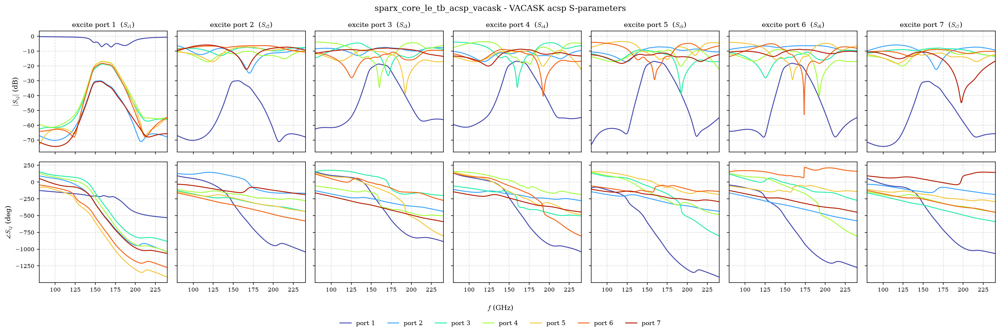
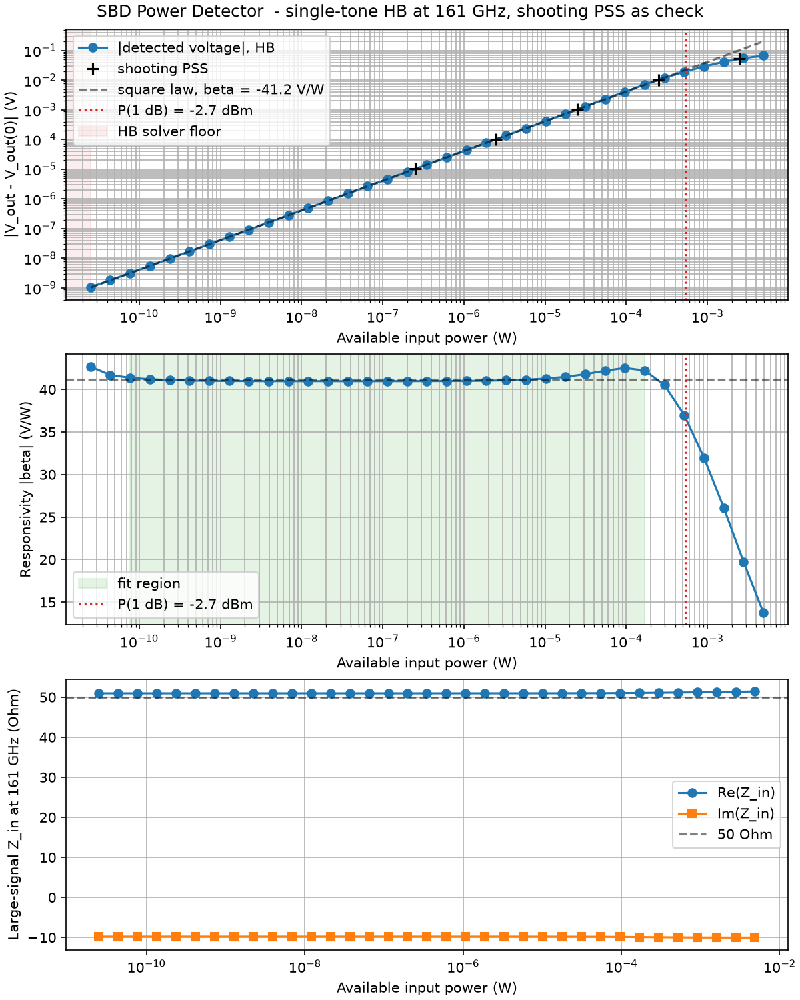
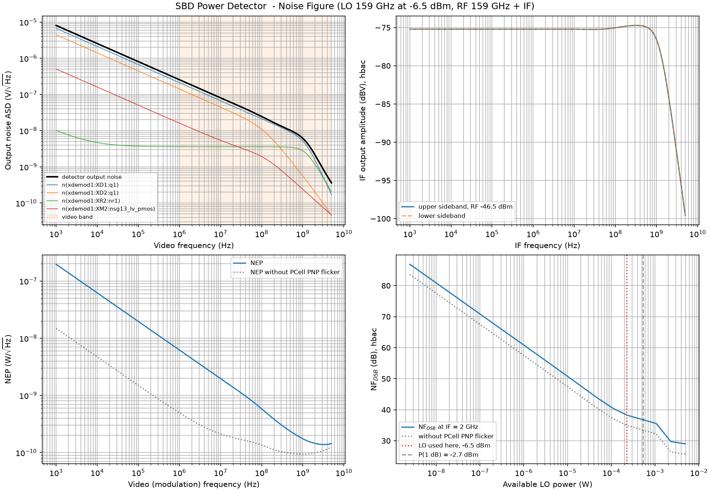
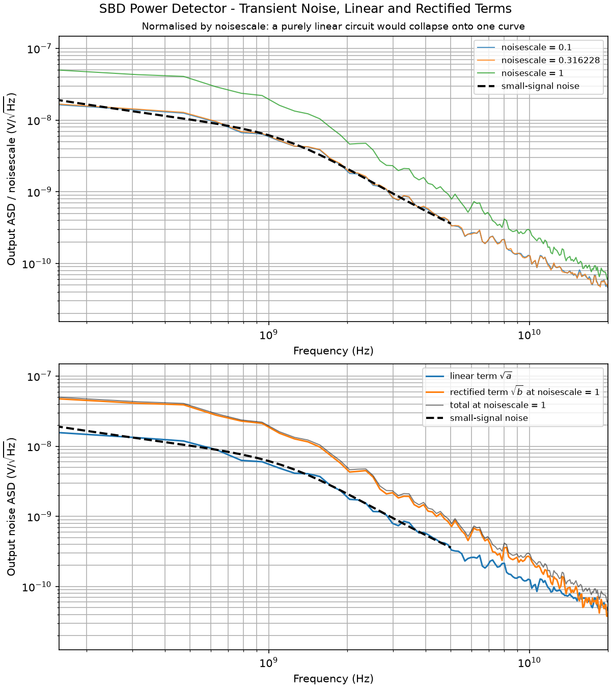
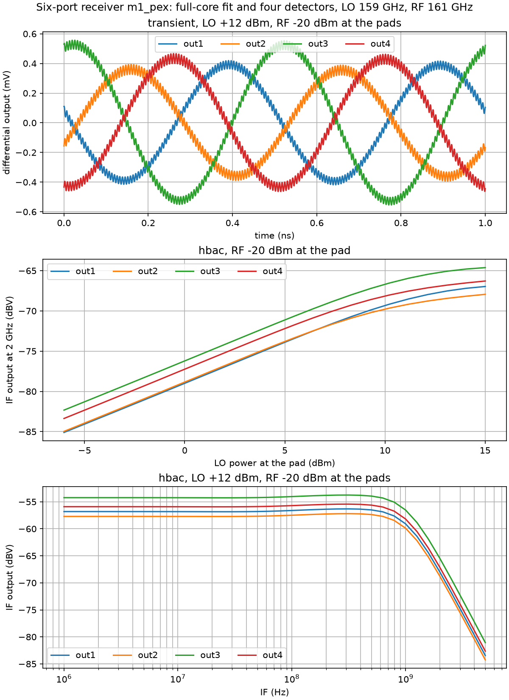

# Xschem Testbenches

This folder holds every circuit-level testbench of SPARX, for both simulators the flow uses, together with the post-processing scripts that turn the raw simulator output into the numbers and figures used in the documentation and in the papers.

There are 21 testbenches in four groups:

| group | what is simulated | count |
|---|---|---|
| [Passive models, S-parameters](#1-passive-models-s-parameters) | the snp2le lumped-element fits of the EM results, resimulated | 10 |
| [Passive models, transient](#2-passive-models-transient) | the same fits, in the time domain | 3 |
| [SBD power detector](#3-sbd-power-detector) | the active block, from square-law verification to noise figure | 5 |
| [Receiver and top level](#4-receiver-and-top-level) | the six-port core driving the four detectors | 3 |

Everything below is reproducible with the `make` targets given in each section. All results quoted here come from those targets, at the typical corner and 27 degrees Celsius unless stated otherwise.

## Running a testbench

The flow runs inside the [IIC-OSIC-TOOLS](https://github.com/iic-jku/IIC-OSIC-TOOLS) container. Source the repository environment first, then call the generic target:

```bash
source .designinit                                   # sets PDK=ihp-sg13g2 and the tool paths
make sim-xschem TB=<testbench name without .sch>     # netlist, simulate, post-process
make sim-all                                         # every testbench, in the order below
```

`sim-xschem` netlists the schematic, runs the simulator, and then calls the matching post-processing script, so a single command takes you from schematic to figure. The Makefile refuses to run with any PDK other than `ihp-sg13g2`, because the container default (`ihp-sg13cmos5l`) is a different metal stack and silently produces wrong extractions.

Two ordering constraints matter:

- The detector PSS testbench must run before the NF testbench, because the NF script reads the fitted responsivity out of `plot_simulations/data/sparx_powdet_sbd_beta<variant>.json` to convert noise into NEP and MDS.
- The passive fits must exist in `netlist/spice/` and `netlist/spectre/` before any testbench that instantiates them. They are produced by `make snp2le` from the de-embedded Touchstone files, see the repository README.

Outputs land in three places. The raw simulator output goes to `simulations/` (git-ignored), the machine-readable results to `plot_simulations/data/` as CSV and JSON, and the overview figures to `plot_simulations/figures/` as PNG.

## VACASK analyses, and why each one is used

[VACASK](https://codeberg.org/arpadbuermen/VACASK) is the reason the active parts of SPARX can be characterized at all in an open-source flow. ngspice has no large-signal periodic analysis, so a detector pumped by a strong local oscillator cannot be handled there.

These are the analyses this folder uses. Which analyses a given build has is worth checking against the binary rather than the documentation or the source tree, because the checked-out `designs/VACASK` tree is not necessarily the installed build. Two ways to check: run a one-line probe deck, where an unregistered analysis reports `Analysis type 'x' not found.` and a registered one with a bad parameter reports `Parameter 'y' not found.`, or read the registry strings out of the binary with `strings $(which vacask) | grep "Analysis type:"`.

| analysis | what it computes | where it is used here |
|---|---|---|
| `op`, `dc` | operating point and DC sweep | bias check in every bench |
| `ac` | small-signal AC around the DC operating point | not used directly |
| `acsp` | S-parameters from an AC analysis with port definitions | all 10 passive-model benches |
| `noise` | small-signal noise around the **DC** operating point | detector NF and NEP |
| `tran` | transient, with optional noise sources (`noisefmax`, `noisescale`) | receiver transient, transient-noise bench |
| `hb` | harmonic balance, the large-signal periodic solution in the frequency domain, single tone or multi-tone | detector transfer curve, receiver LO and RF levels |
| `pss` | periodic steady state by shooting, the same solution in the time domain | independent check of the HB transfer curve |
| `hbac` | small-signal transfer around the HB solution, sideband to sideband | detector conversion gain and video response, receiver IF response |

### Why two ways to compute the same steady state

`hb` and `pss` both produce the periodic steady state, and they are complementary rather than redundant. Harmonic balance solves for the Fourier coefficients directly, which suits mildly nonlinear, high-Q and multi-tone problems. Shooting solves for the initial condition that reproduces itself after one period, which suits stiff, sharply switching circuits. Running both on the same detector and getting the same transfer curve is the strongest single piece of evidence in the detector section, because the two algorithms share no code path. They agree within 0.6 percent here.

### What `hbac` is, and how it relates to PAC

Once a periodic steady state exists, linearizing around it gives a linear periodically time-varying system, and a small signal applied at one sideband appears at others. That analysis exists in two flavours, named after the engine that produced the large-signal solution underneath:

| large-signal engine | small-signal | noise | transfer function | S-parameters |
|---|---|---|---|---|
| shooting (`pss`) | `pac` | `pnoise` | `pxf` | `psp` |
| harmonic balance (`hb`) | `hbac` | `hbnoise` | `hbxf` | `hbsp` |

So `hbac` is literally harmonic-balance AC, and it is the same class of analysis as `pac`, only built on the HB solution instead of the shooting solution. VACASK's own registry string calls it "HBAC (quasi)periodic small-signal", where "quasi" acknowledges that an HB state can carry two incommensurate tones, which a strictly periodic shooting solution cannot represent.

**This build has `hbac` but no `pac`, and neither `pnoise` nor `hbnoise`.** The consequence is stated plainly in the detector section below and in the paper: there is no noise analysis around a pumped large-signal state, so the detector's output noise density is taken at the quiescent operating point. That misses the bias shift the LO causes and any noise folding from the LO harmonics. For this circuit the error is second order, because the dominant noise source is a baseband current at the transimpedance amplifier input, which neither shifts much nor folds, but it is an approximation and not a measurement.

## ngspice, and why both simulators

Every passive model is simulated in both ngspice and VACASK. `snp2le` emits two netlist dialects from the same fit, a SPICE one and a Spectre-style one, and running both is how that conversion is validated. The two agree within 0.001 dB across the band. That validates the two dialects and nothing more, since both describe the same fitted network.

ngspice is also used for the top-level transients, as an independent integrator against the VACASK transient of the same circuit.

---

## 1. Passive models, S-parameters

**What they are.** The EM results from AWS Palace are fitted to lumped-element models by `snp2le`, and these benches resimulate those models so the fit can be compared against the Touchstone data it came from.

| testbench | DUT | ports |
|---|---|---|
| `sparx_bpf_le_tb_acsp_ngspice`<br>`sparx_bpf_le_tb_acsp_vacask` | hairpin bandpass filter fit, order 13 | 2 |
| `sparx_wpd_le_tb_acsp_ngspice`<br>`sparx_wpd_le_tb_acsp_vacask` | Wilkinson divider fit, order 10 | 3 |
| `sparx_blc_le_tb_acsp_ngspice`<br>`sparx_blc_le_tb_acsp_vacask` | branch-line coupler fit, order 6 | 4 |
| `sparx_core_le_tb_acsp_ngspice`<br>`sparx_core_le_tb_acsp_vacask` | **single fit of the whole core**, order 24 | 7 |
| `sparx_core_tb_acsp_ngspice`<br>`sparx_core_tb_acsp_vacask` | **composition** of BPF, WPD and three BLCs | 7 |

**Read the last two rows carefully.** `sparx_core_le_tb_*` is the single 7-port fit of the full-core EM solve. `sparx_core_tb_*` is the core built by wiring the individual block fits together. The `le` suffix marks the single fit, not the lumped-element composition, which is the opposite of what the name suggests on first reading.

**Post-processing.** `plot_simulations/plot_n_port_tb_acsp_ngspice.py` and `plot_n_port_tb_acsp_vacask.py`. One script serves every port count. The VACASK script discovers the port count by probing the `s(i,j)` vector names, the ngspice script reads the column header of the `wrdata` table.

**Settings.** ngspice runs `sp lin 1001 f_min f_max`, VACASK runs `analysis sp1 acsp ports=["V1", "R1", ...]` over the same grid. The band comes from `sim_range.inc` and `sim_range.spice`, currently 80 GHz to 240 GHz.

```bash
make sim-xschem TB=sparx_core_le_tb_acsp_vacask
```



**Findings.**

- The order-24 full-core fit reproduces the EM Touchstone at 160 GHz within 0.44 dB and 9.8 degrees across all 49 S-parameters. Both extremes fall on one output-to-output coupling at -35 dB, every other parameter is within 0.36 dB and 0.8 degrees.
- The composed core reproduces the LO-path imbalances of the full-core solve within 0.6 dB and 5 degrees, but overestimates the RF-path amplitude imbalance by up to 3.1 dB, because it contains neither the coupling between adjacent couplers nor the interconnects between the blocks.
- ngspice and VACASK agree within 0.001 dB on both models.

**Limits.**

- `sim_range.{inc,spice}` claims to be auto-generated but `make snp2le` does not regenerate it. If the fit band is changed, both files must be edited by hand, otherwise the benches sweep outside the band the fit ever saw, where a vector fit extrapolates confidently and wrongly.
- A dB comparison against the Touchstone is meaningless in the filter stopband notches, where the level is -55 dB to -66 dB and a slightly shifted notch costs tens of dB while the linear error stays below 0.08. Compare in the passband, or compare linear.
- The fitted resistors are emitted noiseless on purpose, so these models must not be used for a noise budget of the passives.

## 2. Passive models, transient

**What they are.** Time-domain sanity checks that the fitted models are stable and causal, and a cross-check of the two netlist dialects outside the frequency domain.

| testbench | DUT | analysis |
|---|---|---|
| `sparx_blc_le_tb_tran_ngspice` | branch-line coupler fit | `tran 100f 40p` |
| `sparx_wpd_le_tb_tran_ngspice` | Wilkinson divider fit | `tran 100f 20p` |
| `sparx_core_le_tb_tran_ngspice` | full-core fit, ideal sources | `tran 100p 4n 0 20f` |

**Post-processing.** `plot_simulations/plot_n_port_tb_tran_ngspice.py`.

**Limits.** The trailing `20f` on the core bench is a maximum timestep, and it is not optional. Without it the Gear integrator takes steps of about 0.3 ps on a 160 GHz carrier, damps it, and the result is quietly wrong rather than obviously wrong. This is the same trap as in the top-level transients below.

## 3. SBD power detector

The active block. A forward-biased Schottky barrier diode feeds a transimpedance amplifier, with a replica branch for differential readout. Five testbenches cover it, from the verification that existed at tapeout to the full receiver-front-end characterization added later.

### 3.1 Two-tone verification, as at tapeout

| | |
|---|---|
| **Testbench** | `sparx_powdet_sbd_tb_hb_vacask` |
| **Post-processing** | `plot_sparx_powdet_sbd_tb_hb_V-W_vacask.py`, `plot_sparx_powdet_sbd_tb_hb_dBV-dBV_vacask.py` |
| **Analyses** | two-tone `hb` at 159 GHz and 161 GHz, `truncate="diamond"`, LO amplitude stepped over 30 mV, 100 mV and 300 mV, RF amplitude swept 10 uV to 30 mV |

This is what was available when the chip was taped out in March 2026, and it confirms square-law detection, the IF output proportional to the product of the RF and LO amplitudes, over the intended input range. It says nothing about responsivity in absolute terms, input impedance, compression, or noise.

**Limits.** A cold two-tone solve does not converge on this circuit. The LO amplitude is ramped for that reason, and the spectrum size dominates the cost: `nharm=[5,2]` runs in seconds where `[9,5]` takes minutes, and the two differ by 0.4 dB in the IF amplitude, so a small spectrum is a cross-check and not a measurement.

```bash
make sim-xschem TB=sparx_powdet_sbd_tb_hb_vacask
```

### 3.2 Transfer curve and input impedance

| | |
|---|---|
| **Testbench** | `sparx_powdet_sbd_tb_pss_vacask` |
| **Post-processing** | `plot_sparx_powdet_sbd_tb_pss_vacask.py` |
| **Analyses** | single-tone `hb` at 161 GHz, `nharm=15`, amplitude swept 100 uV to 1.4 V at 8 points per decade, which is -76 dBm to +6.9 dBm available into 50 Ohm, followed by five shooting `pss` runs at 10 mV, 31.6 mV, 100 mV, 316 mV and 1.0 V |
| **Outputs** | `data/sparx_powdet_sbd_beta<variant>.json`, `data/sparx_powdet_sbd_pss<variant>.csv`, `figures/sparx_powdet_sbd_pss_sweep<variant>.png` |



The detected output voltage is the differential output of the detector against its replica, measured from its zero-drive value. The zero-drive value is a *fitted* parameter of the square-law line rather than a measured point, because the HB DC bin sits a systematic 0.5 uV away from the `op` analysis and the lowest sweep point carries its own detected term. Fitting both the offset and the slope on the square-law region avoids subtracting either bias twice.

**Findings**, fabricated design:

| quantity | value |
|---|---|
| responsivity | 41 V/W, flat from -71 dBm to -8 dBm |
| 1 dB compression | -2.7 dBm |
| input impedance at 161 GHz | 51 - j10 Ohm, flat up to compression |
| coupling efficiency | 0.25 percent of the available power reaches the junction |
| shooting PSS against HB | agree within 0.57 percent over five drive levels |

The coupling efficiency is the headline result of the block. The 52 Ohm termination that gives the flat, drive-independent match is also what burns the power: it shunts all but about 2 percent of the input into the diode branch, and the cell's 1.36 kOhm series resistance and its junction capacitance take most of that at 161 GHz.

**Limits.**

- The HB block runs at `reltol=1e-8 abstol=1e-16 vntol=1e-9`. The detected term is about 1 nV at the bottom of the sweep, riding on a 7 mV offset, and at default tolerances the fitted responsivity comes out 25 percent low at -40 dBm.
- The PSS block relaxes back to `reltol=1e-3`, because the shooting stabilization transient aborts at tighter settings. `driven=1` and `maxacfreq=0` are both required, without the first the solver looks for an oscillator that is not there, without the second it sizes its timestep for a periodic small-signal follow-up that is never run.
- The five PSS points are five separate analyses rather than a sweep, because a failing rung of a sweep takes the whole rawfile with it.

### 3.3 Noise figure, NEP and minimum detectable power

| | |
|---|---|
| **Testbench** | `sparx_powdet_sbd_tb_nf_vacask` |
| **Post-processing** | `plot_sparx_powdet_sbd_tb_nf_vacask.py` |
| **Analyses** | small-signal `noise` from 1 kHz to 5 GHz, `hbac` for the upper and the lower sideband over the same range, and `hbac` at a fixed 2 GHz IF while the LO amplitude is swept from 1 mV to 1.4 V |
| **Outputs** | `data/sparx_powdet_sbd_nf<variant>.{json,csv}`, `data/sparx_powdet_sbd_nf_lo<variant>.csv`, `figures/sparx_powdet_sbd_nf<variant>.png` |



In the LO-offset mode the detector is a mixer, so a noise figure is well defined. The conversion gain of each sideband to the IF comes from `hbac`, and the double-sideband noise figure follows, both sidebands carrying signal in a six-port.

**Findings**, at a 2 GHz IF and -6.5 dBm of LO:

| quantity | m = 1, fabricated | m = 1, post-layout | m = 16 |
|---|---|---|---|
| NF (double sideband) | 38.2 dB | 38.5 dB | 25.6 dB |
| NEP at 1 MHz | 6.2 nW per root Hz | 6.3 | 1.1 |
| NEP at 1 GHz | 175 pW per root Hz | 179 | 18 |
| minimum detectable power, 1 MHz to 5 GHz | -18.0 dBm | -17.9 dBm | -25.4 dBm |
| video bandwidth | 1.26 GHz | 1.12 GHz | 1.77 GHz |

Two results worth carrying forward. About 94 percent of the output noise power between 1 MHz and 5 GHz is flicker noise of the parasitic vertical PNP that the PDK model of the Schottky diode contains, so nothing that was sized in this design sets the noise floor. And because that noise is 1/f across the whole video band, detecting at DC as a conventional six-port does is expensive: moving the outputs to a 1 GHz IF improves the NEP 35-fold.

**Limits.**

- **No periodic noise analysis exists in this build**, so the output noise density is the one at the quiescent operating point. It carries neither the LO-induced bias shift nor noise folding from the LO harmonics, which is why the curves above the compression point are optimistic. See the analysis table above.
- The `hbac` conversion is cross-checked against the closed form for a square-law detector and agrees within 0.15 dB for all three versions, so the conversion side of the noise figure is on firm ground even though the noise side is approximate.
- The dominant noise source is a model extrapolation. The PNP flicker model is evaluated at about 5 pA of base current, far below any plausible characterization current, so the script also reports every figure with those contributors removed. Silicon decides which is right.
- An `include` of the operating-point `.save` file breaks `hbac` binding and only `hbac`. It is not included in this bench for that reason.

### 3.4 Transient noise, a cross-check only

| | |
|---|---|
| **Testbench** | `sparx_powdet_sbd_tb_tn_vacask` |
| **Post-processing** | `plot_sparx_powdet_sbd_tb_tn_vacask.py` |
| **Analyses** | three transient runs, 100 ns at 1 ps steps, `noisefmax=20G`, differing only in `noisescale` |



**This testbench is deliberately not part of `sim-all`, and none of its numbers are reported anywhere.** It exists to validate the small-signal noise setup, which it does: splitting the PSD as a linear plus a quadratic term in `noisescale` squared and solving from the extreme scales, the linear term reproduces the small-signal analysis within 12 percent at 0.3, 1 and 3 GHz.

**Limits.** At full noise amplitude the output is 3 to 8 times above the small-signal answer, and that excess is not physics. It fails two independent checks. Its magnitude is 58 dB larger than what rectification of the circuit's own noise could produce, and its scaling order is 2.7 to 2.8 where a rectified term must be exactly 2. Single devices show no excess with identical settings, and the excess grows with `noisefmax` without converging. The working conclusion is a numerical artefact of SDE transient noise on a stiff, strongly nonlinear circuit. Until that is understood, full-amplitude transient noise on this class of circuit is not a measurement.

Four settings are mandatory and each was found by bisecting an aborting run: `noisemode="sde"`, an `rsw` on every diode model card, `tran_noiselte` far above its default of 1, and no `noise` analysis anywhere in the same deck.

### 3.5 ngspice cross-check

| | |
|---|---|
| **Testbench** | `sparx_powdet_sbd_tb_ngspice` |
| **Analyses** | `sp lin 31 100G 200G` and `tran 0.05p 22n 20n` |

The independent cross-simulator check of the detector. It also carries the two commented-out PEX include lines, see the next section.

## 4. Receiver and top level

### 4.1 Receiver characterization

| | |
|---|---|
| **Testbench** | `sparx_top_le_tb_rx_vacask` |
| **Post-processing** | `plot_sparx_top_le_tb_rx_vacask.py` |
| **DUT** | the order-24 full-core fit driving four post-layout detectors, with 5 pF off-chip on every output |
| **Outputs** | `data/sparx_top_le_rx<variant>.json`, three CSVs, `figures/sparx_top_le_rx<variant>.png` |



Six analyses in one bench, all at 159 GHz LO and 161 GHz RF applied through 50 Ohm at the pads:

| analysis | purpose |
|---|---|
| `op1` | bias check of four detectors at once |
| `rx_hb_rf` | RF alone, single-tone HB, gives the RF-path loss from pad to each detector |
| `rx_hb` | LO alone, single-tone HB, gives the LO-path loss and the drive each detector sees |
| `rx_hbac_if` | IF response of the four outputs from 1 MHz to 5 GHz |
| `rx_hbac_lo` | IF output at 2 GHz against LO power at the pad, the compression curve |
| `rx_hb2` | two-tone HB at the transient's levels, an independent cross-check |
| `rx_tran` | 10 ns transient, the waveform figure |

**Findings.**

- The LO path through filter, divider and coupler loses 16.9 dB to 18.6 dB, so +12 dBm at the pad places each detector at -6.6 dBm to -4.9 dBm, which is the operating point the detector was characterized at.
- The RF path through two couplers loses 5.9 dB to 9.7 dB.
- The differential I and Q outputs show an amplitude imbalance of 2.1 dB and a phase difference of 85.3 degrees, which the six-port calibration absorbs.
- That imbalance is predicted by the EM data alone to within 0.4 dB and 0.7 degrees, by forming the product of the conjugated LO-path and the RF-path S-parameters per output. The circuit simulation and the EM solve agree without any fitting.
- The transient reproduces the `hbac` amplitudes within 0.2 dB, and the two-tone HB within 0.4 dB.

**Limits.**

- The transient runs 10 ns because the detected DC needs that long to settle. At 3 ns the residual drift still biased the extracted IF amplitude. At 10 ns the drift in the last nanosecond is 7 to 10 uV per ns against IF amplitudes of 358 to 526 uV.
- The IF amplitude is extracted by a least-squares fit of the 2 GHz fundamental with constant and drift columns in the basis. Half the peak-to-peak reads up to 1.4 dB high, because the carrier feed-through rides on the outputs.
- The fitted passive models are noiseless, so a noise analysis of the whole receiver would miss their thermal noise. The receiver noise figure is therefore stated as a composition of the detector figure and the RF-path loss rather than simulated.

### 4.2 Top-level transients in ngspice

| testbench | core model | analysis |
|---|---|---|
| `sparx_top_le_tb_tran_ngspice` | single 7-port fit | `tran 1p 10n 0 20f` |
| `sparx_top_tb_tran_ngspice` | composed from block fits | `tran 1p 3n 0 20f` |

The independent integrator check of the receiver transient. ngspice reproduces the VACASK 2 GHz fundamental within 1 percent.

**Limits.** The `20f` maximum timestep is mandatory, as in the passive transients. Without it the Gear integrator takes 0.3 ps steps on the 161 GHz carrier, damps it, and the IF outputs come out twelve times too small in a run that finishes quickly and looks healthy. The `.option interp` keeps the rawfile at 48 MB instead of 519 MB.

---

## Design variants, and why no symbol is swapped

The detector is characterized in three versions, but there is only one schematic. `scripts/powdet_variant.py` rewrites the **emitted netlist** before the simulator sees it:

| variant | what the rewrite does |
|---|---|
| `m1` | the design as fabricated, copied unchanged |
| `m16` | both Schottky instances set to `nx=4 ny=4`, that is 16 parallel unit cells |
| `m1_pex` | the schematic subcircuit replaced by the Magic full-RC extraction from `netlist/pex/`, translated into VACASK syntax |

```bash
make sim-xschem TB=sparx_powdet_sbd_tb_pss_vacask VARIANT=m16
make sim-powdet-variants        # both variants, both detector benches
```

Each variant runs in `simulations/<variant>/` and every output file carries the variant as a suffix.

**The PEX symbols in the testbenches are dormant and are never simulated.** Each detector bench does instantiate `sparx_powdet_sbd_pex.sym` next to the schematic symbol, but it carries `spice_ignore=true` and `spectre_ignore=true`, and in the ngspice bench the two PEX include lines are commented out. The verification is that the string `sparx_powdet_sbd_pex` appears zero times in every emitted netlist. The post-layout results come from the netlist rewrite above, not from a symbol swap. The same holds at the top level, where `sparx_top_le.sch` instantiates the schematic symbol four times and the PEX symbol not at all.

What the extraction contributes is worth stating exactly, since "post-layout" can mean many things. With the resistance-gated `extresist` settings the Makefile uses, the extracted netlist is the schematic plus its parasitic capacitors, plus the deterministic route resistances of the supply, output and reference nets, of which the 22 Ohm in series with the feedback resistor is the only one that changes a reported number. The ground net is idealized onto the pin, because the extraction returns the transistor sources to ground through a substrate-like path that the layout does not have, and leaving it in place changes every large-signal number by 6 to 16 dB.

## Traps worth knowing

These cost real time to find, and none of them announce themselves.

- **A maximum timestep is not optional on any 160 GHz transient.** Gear damps the carrier and the answer is wrong by a factor of twelve while the run looks healthy.
- **A symbol without a `spectre_format` attribute is dropped from a VACASK netlist entirely**, without a warning, and the netlist still simulates. Assert that the device name appears in the emitted netlist.
- **VACASK is case sensitive where ngspice is not.** A `body=VSS` attribute on a net called `vss` becomes a second, floating node and the operating point stops on a zero pivot.
- **`vacask` exits 0 when an analysis aborts** and leaves a part-written rawfile. Grep the transcript for `aborted` or `failed`, do not trust the exit status.
- **Check the technology line in a PEX header before believing it.** Running the extraction under the container's default PDK produces a netlist that is missing Metal5, TopMetal2, the MIM capacitors and both diodes, and it exits cleanly.
- **Magic announces an invented ground net in its own log.** `Orphaned node "vss" arbitrarily attached` means every resistance on that net is meaningless.
- The extraction's `.tN` terminal labels are not stable between runs. Compare two extractions by per-net totals, never label by label.

## File map

```
testbenches/xschem/
  *.sch                                   the 21 testbenches
  sim_range.{inc,spice}                   the frequency band the passive benches sweep
  xschemrc                                library paths for this folder
  plot_simulations/
    plot_n_port_tb_acsp_{ngspice,vacask}.py   S-parameters, any port count
    plot_n_port_tb_tran_ngspice.py            passive transients
    plot_sparx_powdet_sbd_tb_*.py             detector: hb, pss, nf, tn
    plot_sparx_top_le_tb_rx_vacask.py         receiver
    sparam_plot.py, ngspice2python.py         shared helpers
    data/                                     CSV and JSON results
    figures/                                  PNG overview figures
  simulations/                            raw simulator output, git-ignored
```

Related material lives in `netlist/spice/` and `netlist/spectre/` for the fitted passive models, `netlist/pex/` for the extractions, `verification/em/s-parameter/` for the Touchstone files the fits come from, and `scripts/powdet_variant.py` for the variant rewriter.
