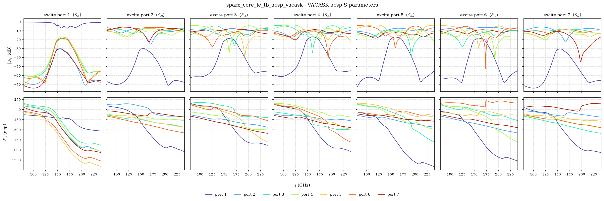
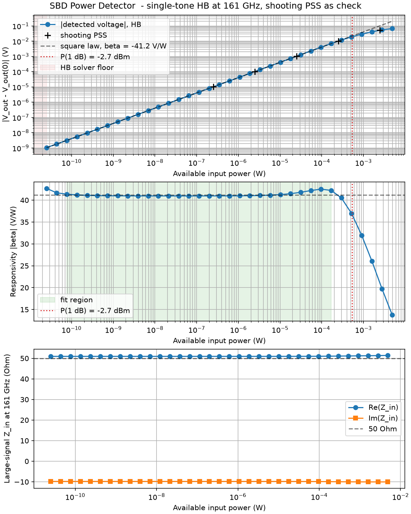
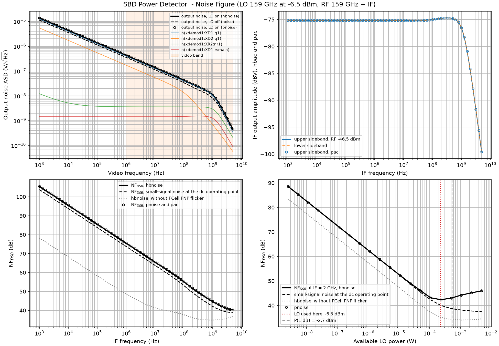
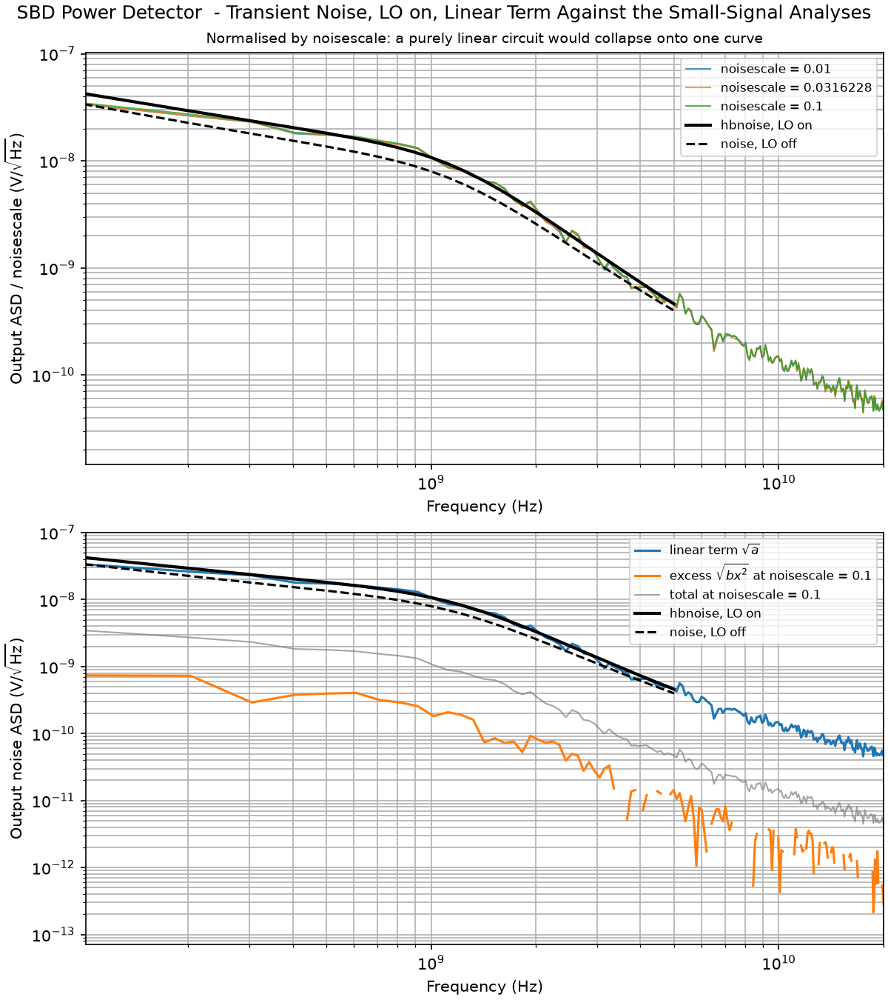
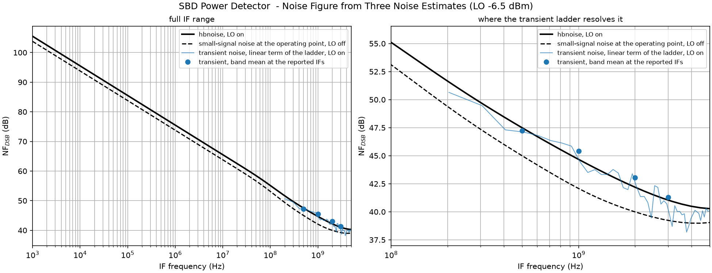
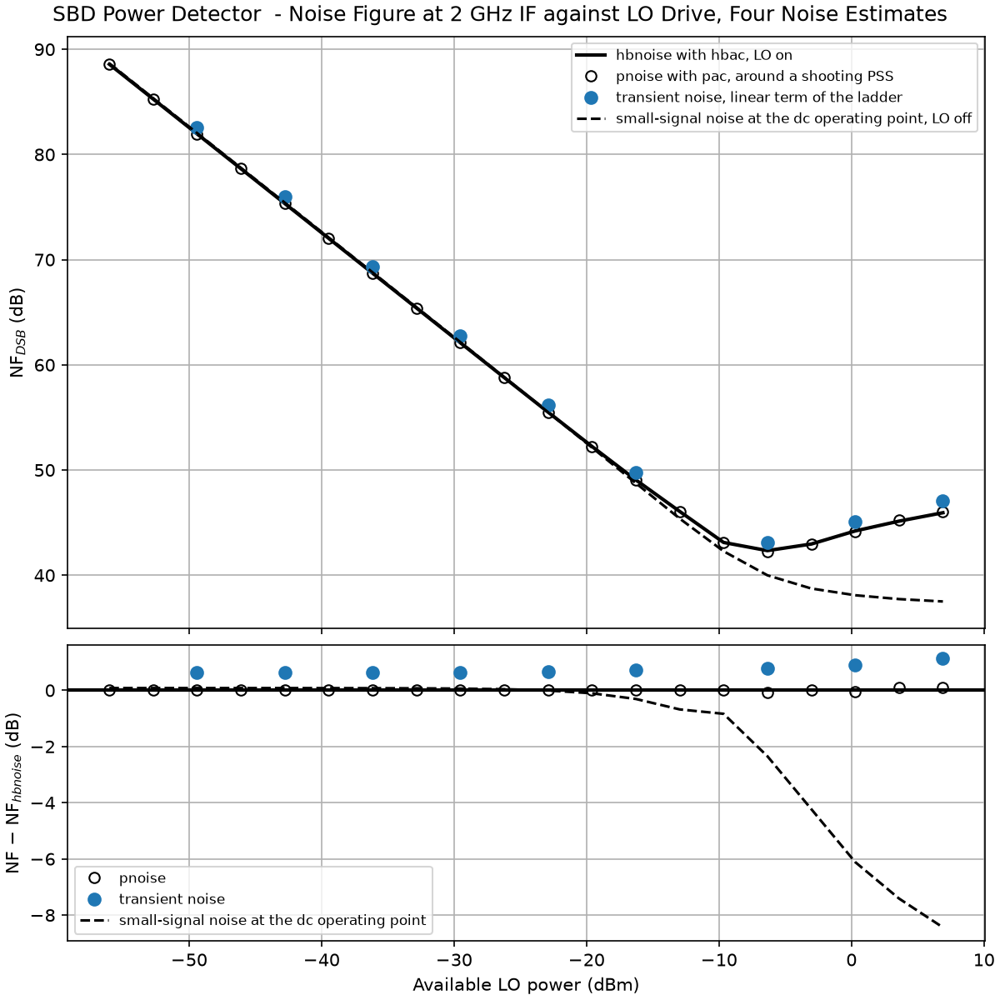
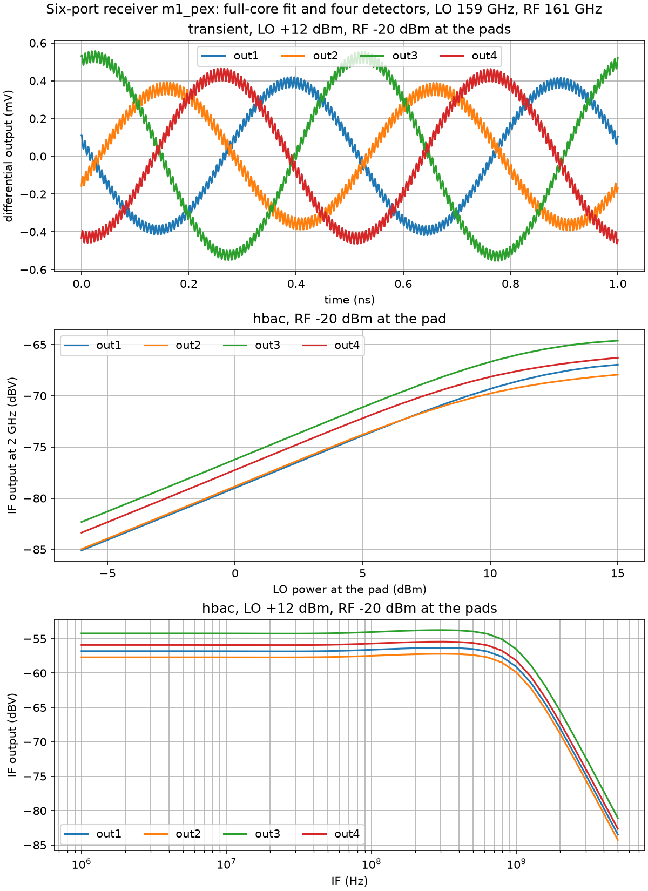

# Xschem Testbenches

This folder holds every circuit-level testbench of SPARX, for both simulators the flow uses, together with the post-processing scripts that turn the raw simulator output into the numbers and figures used in the documentation.

There are 22 testbenches in four groups:

| group | what is simulated | count |
|---|---|---|
| [Passive models, S-parameters](#1-passive-models-s-parameters) | the snp2le lumped-element fits of the EM results, resimulated | 10 |
| [Passive models, transient](#2-passive-models-transient) | the same fits, in the time domain | 3 |
| [SBD power detector](#3-sbd-power-detector) | the active block, from square-law verification to noise figure | 6 |
| [Receiver and top level](#4-receiver-and-top-level) | the six-port core driving the four detectors | 3 |

Everything below is reproducible with the `make` targets given in each section. All results quoted here come from those targets, at the typical corner and 27 degrees Celsius unless stated otherwise.

## Running a testbench

The flow runs inside the [IIC-OSIC-TOOLS](https://github.com/iic-jku/IIC-OSIC-TOOLS) container. Source the repository environment first, then call the generic target:

```bash
source .designinit                                   # sets PDK=ihp-sg13g2 and the tool paths
make sim-xschem TB=<testbench name without .sch>     # netlist, simulate, post-process
make sim-all                                         # every testbench, in the order below
```

`sim-xschem` netlists the schematic, runs the simulator, and then calls the matching post-processing script, so a single command takes you from schematic to figure. The Makefile refuses to run with any PDK other than `ihp-sg13g2`, because the container default (`ihp-sg13cmos5l`) is a different metal stack and silently produces wrong extractions.

**Netlists without Xschem.** `netlists/` holds the VACASK netlists of the four benches the Code-a-Chip notebook runs, `sparx_powdet_sbd_tb_pss_vacask`, `sparx_powdet_sbd_tb_nf_vacask`, `sparx_powdet_sbd_tb_tn_vacask` and `sparx_top_le_tb_rx_vacask`, each with its `.save` file, for environments without Xschem such as Google Colab. They are what the netlisting step of `sim-xschem` writes to `simulations/`, and their relative includes and post-processing paths assume they run there: copy them to `simulations/` and run `vacask -qp -sp <testbench>.spectre` in that folder, then the matching script from `plot_simulations/`. The post-layout receiver is not stored, it is produced the way `sim-xschem` does it, by `scripts/powdet_variant.py --variant m1_pex` into `simulations/m1_pex/`. After a change to one of these schematics, export the netlist again with `make sim-xschem TB=<testbench>` and copy it from `simulations/`.

The notebook runs them on the VACASK `1b48553` build stored in `sscs-ose-code-a-chip/build/vacask/`, since no IIC-OSIC-TOOLS image ships `pac` and `pnoise` yet, so all four are plain exports of their schematics. On an older binary the NF plot script still post-processes the NF deck and skips the shooting cross-check when the `pac` and `pnoise` rawfiles are missing.

Three ordering constraints matter:

- The detector PSS testbench must run before the NF testbench, because the NF script reads the fitted responsivity out of `plot_simulations/data/sparx_powdet_sbd_beta<variant>.json` to convert noise into NEP and MDS.
- The two detector transient-noise testbenches must run after the NF testbench, because their scripts check the ladder against the `hbnoise` rawfiles of the NF run, turn it into a noise figure with the NF bench's conversion, and take the `pnoise` result for their comparison figures from the NF bench's JSON.
- The passive fits must exist in `netlist/spice/` and `netlist/spectre/` before any testbench that instantiates them. They are produced by `make snp2le` from the de-embedded Touchstone files, see the repository README. The full-core fit is the exception: it is made from `sparx160_core.s7p`, the Touchstone without de-embedding, with `make snp2le SNP=verification/em/s-parameter/sparx160_core.s7p ORDER=24 LE_FORMAT=spectre LE_OUT=netlist/spectre/sparx_core_le.inc`.

**The detector PSS and NF benches need VACASK `1b48553` (2026-09-29) or later.** The NF bench runs `pac` and `pnoise`, which reached VACASK `main` on 2026-09-25 and 2026-09-28. The PSS bench relies on `pss` treating a circuit as driven unless `oscillator=1` is given, which came with `pac`: older builds need `driven=1` and solve for the period of an oscillator without it. No tagged VACASK release and no IIC-OSIC-TOOLS image carries either change yet. The 2026.09 image ships `89e888d` (2026-09-21), which has `hbnoise` but neither `pac` nor `pnoise`, and the 2026.08 image ships `a9d8860`, which has none of the three. On such a binary the PSS bench aborts its nine shooting analyses ("PSS transient failed") and the NF bench reports `Analysis type 'pac' not found` for each `pac` and `pnoise` and runs the rest, while VACASK still exits 0. Check the binary first: `strings $(which vacask) | grep -c "PNOISE periodic"` prints 0 on a build without `pnoise`. The other benches use no analysis newer than the 2026.09 image.

The results in this folder were produced with `main` at `1b48553`, built inside the running 2026.09 container the way IIC-OSIC-TOOLS builds its release binary (`_build/images/vacask/scripts/install.sh`: Boost 1.88 static with `BOOST_PROCESS_V2_DISABLE_PIDFD_OPEN`, `-march=x86-64-v2`, OpenVAF from `/foss/tools/openvaf/bin`). Four development packages the runtime container lacks have to be installed first: `libopenblas-dev`, `libsuitesparse-dev`, `libtomlplusplus-dev` and `libfftw3-dev`, the last one new with `pac` and `pnoise`. The build takes about 8 minutes on 14 cores and the result replaces `/foss/tools/vacask`, so it is lost when the container is recreated.

The NF bench as it stood before `pac` and `pnoise` were added gives the same `noise`, `hbac` and `hbnoise` results on `1b48553`, on the 2026.09 binary `89e888d` and on the earlier `e7b5e41` build to 1e-12 relative. The upstream `hbnoise` fixes in between, among them the linearisation at the converged HB solution instead of a stale buffer (`28a0895`), therefore changed nothing on these benches.

Every build since 2026-09-07 carries a newer SPICE BJT model than `a9d8860`, and the difference is visible in these results, see [the model note](#model-note-the-bjt-area-scaling-changed-between-vacask-builds) under the noise figure bench.

Outputs land in three places. The raw simulator output goes to `simulations/` (git-ignored), the machine-readable results to `plot_simulations/data/` as CSV and JSON, and the overview figures to `plot_simulations/figures/` as PNG.

## VACASK analyses, and why each one is used

[VACASK](https://codeberg.org/arpadbuermen/VACASK) is the reason the active parts of SPARX can be characterized at all in an open-source flow. ngspice has no large-signal periodic analysis, so a detector pumped by a strong local oscillator cannot be handled there.

These are the analyses this folder uses. Which analyses a given build has is worth checking against the binary rather than the documentation or the source tree, because the checked-out `designs/VACASK` tree is not necessarily the installed build. Two ways to check: run a one-line probe deck, where an unregistered analysis reports `Analysis type 'x' not found.` and a registered one with a bad parameter reports `Parameter 'y' not found.`, or read the registry strings out of the binary with `strings $(which vacask) | grep "Analysis type:"`.

| analysis | what it computes | where it is used here |
|---|---|---|
| `op`, `dc` | operating point and DC sweep | bias check in every bench |
| `ac` | small-signal AC around the DC operating point | not used directly |
| `acsp` | S-parameters from an AC analysis with port definitions | all 10 passive-model benches |
| `noise` | small-signal noise around the **DC** operating point | detector NF and NEP |
| `tran` | transient, with optional noise sources (`noisefmax`, `noisescale`) | receiver transient, transient-noise bench |
| `hb` | harmonic balance, the large-signal periodic solution in the frequency domain, single tone or multi-tone | detector transfer curve, receiver LO and RF levels, and the steady state under `hbac` and `hbnoise` |
| `pss` | periodic steady state by shooting, the same solution in the time domain | independent check of the HB transfer curve, and the steady state under `pac` and `pnoise` |
| `hbac` | small-signal transfer around the HB solution, sideband to sideband | detector conversion gain and video response, receiver IF response |
| `hbnoise` | small-signal noise around the HB solution, every source modulated by the pumped operating point and folded from all spurs to the output | detector noise figure, with the LO on |
| `pac` | small-signal transfer around the shooting PSS solution, sideband to sideband | check of the detector `hbac` conversion |
| `pnoise` | small-signal noise around the shooting PSS solution, modulated and folded like `hbnoise` | check of the detector `hbnoise` noise figure, over the IF and against the LO drive |

### Why two ways to compute the same steady state

`hb` and `pss` both produce the periodic steady state, and they are complementary rather than redundant. Harmonic balance solves for the Fourier coefficients directly, which suits mildly nonlinear, high-Q and multi-tone problems. Shooting solves for the initial condition that reproduces itself after one period, which suits stiff, sharply switching circuits. Running both on the same detector and getting the same transfer curve is the strongest evidence available that the curve is real, because the two algorithms share no code path. They agree within 0.6 percent here. The NF bench extends the pairing to the small-signal analyses on top, `pac` against `hbac` and `pnoise` against `hbnoise`.

### What `hbac` is, and how it relates to PAC

Once a periodic steady state exists, linearizing around it gives a linear periodically time-varying system, and a small signal applied at one sideband appears at others. That analysis exists in two flavours, named after the engine that produced the large-signal solution underneath:

| large-signal engine | small-signal | noise | transfer function | S-parameters |
|---|---|---|---|---|
| shooting (`pss`) | `pac` | `pnoise` | `pxf` | `psp` |
| harmonic balance (`hb`) | `hbac` | `hbnoise` | `hbxf` | `hbsp` |

So `hbac` is literally harmonic-balance AC, and it is the same class of analysis as `pac`, only built on the HB solution instead of the shooting solution. VACASK's own registry string calls it "HBAC (quasi)periodic small-signal", where "quasi" acknowledges that an HB state can carry two incommensurate tones, which a strictly periodic shooting solution cannot represent.

**VACASK `main` has had `hbac` and `hbnoise` since 2026-09-17, and the shooting-based `pac` and `pnoise` since 2026-09-25 and 2026-09-28.** Until 2026-09-17 no periodic noise analysis existed in any build, and the detector noise figure rested on the `noise` analysis at the dc operating point, with the caveat that the LO-induced bias shift and the folding from the LO harmonics were missing. `hbnoise` removes that caveat. The noise figure bench keeps the small-signal noise at the dc operating point next to the pumped result, and the difference is not second order: the LO raises the output noise of the fabricated detector by a factor 1.5 to 1.8 at the operating point, see [the noise figure testbench](#33-noise-figure-nep-and-minimum-detectable-power).

Before the analysis was trusted on this circuit it was checked five ways, all in `testbenches/xschem/simulations/_hbnoise_chk/` (not tracked), on top of the two regression tests VACASK ships for it (`test/test_hbnoise1.sim` and `test_hbnoise2.sim`, which passed on the `hbnoise` build of 2026-09-18):

- On a resistor with a modulated white noise source in an LTI network, `hbnoise` reproduces the closed form, the time average of the modulated PSD through the filter, to 1e-6 at `nharm=15` and 1e-5 at `nharm=5`. A modulated flicker source reproduces the folded closed form to 1e-5 for every drive amplitude, harmonic count and sampling factor tried. One trap on the way: the resistor's flicker is modulated by its own current, which is the source current after the RC filter, so a closed form written with the source current is off by the filter's response at the pump frequency.
- With the LO amplitude set to zero, `hbnoise` around the zero-drive HB solution reproduces the `noise` analysis of the detector, `onoise`, `gain` and every contributor to 1e-9. On `fc997ca` itself the `r3_cmc` resistor sub-contributions differed, because `hbnoise` folded every flicker source as exactly 1/f while those carry a frequency exponent below 1. They are five orders of magnitude below the total here, and the exponent is honoured since the `update-hbnoise` fix.
- The source resistor's thermal noise is stationary, so its `hbnoise` contribution must equal 4kTRs times the sum of |H_k|^2 over all 19 spurs, with H_k the `hbac` transfer from spur k to the IF. It does, to five digits at every IF, and the implied temperature is the simulator default of 300.15 K.
- The `gain` that `hbnoise` reports for a tone at its input spur equals the `hbac` conversion to 1e-5 dB over the IF sweep and 0.005 dB over the LO sweep.
- A transient-noise ladder with the LO on, at noise amplitudes small enough to stay linear, reproduces the `hbnoise` output noise within 11 percent in amplitude at every IF from 0.5 GHz to 3 GHz, where the small-signal `noise` analysis at the dc operating point sits 26 to 47 percent low. The transient and the periodic analysis share no code path. This is the [transient-noise testbench](#34-transient-noise-the-independent-check-of-hbnoise).

A sixth check runs in the NF bench itself since 2026-10-05: `pnoise` around a shooting PSS of the same LO, a large-signal solution that shares no code with harmonic balance, reproduces the `hbnoise` output noise within 0.2 dB at every IF from 1 kHz to 5 GHz for all three detector versions, and `pac` the `hbac` conversion within 0.03 dB. The residual is the harmonic truncation of `hbnoise`, see [the shooting cross-check](#the-shooting-cross-check-pac-and-pnoise). The same check showed that the LO sweep needs more harmonics than the fixed-LO analyses, see [the harmonic count](#nine-harmonics-are-not-enough-above-compression).

Two properties of the analysis to know before writing a bench: a `sweep` applies to the one analysis that follows it, so a swept `hbac` and a swept `hbnoise` need two sweeps, and an offset frequency that lands exactly on a harmonic of the pump puts one spur at zero frequency, where flicker noise is undefined. On `fc997ca` that point returned `nan`, since the `update-hbnoise` fix the spur is left out with a warning. Both are documented upstream now.

Five fixes from this work, one commit each and all verified on this detector, were merged upstream on 2026-09-18 and are in every build since, `89e888d` and `1b48553` included: the `nan` at pump harmonics (`3ee1db5`), the flicker exponent (`811f098`), the sweep documentation (`3759843`), a skip instead of a failure for the four `absdelay` tests when the Verilog-A compiler emits OSDI 0.4 (`19fe50e`), and a note on the BJT base-collector area scaling that differs from released ngspice (`e8f0de7`). The container's OpenVAF-Reloaded emits OSDI 0.4, and VACASK reads delay descriptors only from 0.5, so a delay compiled there is silently zero.

## ngspice, and why both simulators

Every passive model is simulated in both ngspice and VACASK. `snp2le` emits two netlist dialects from the same fit, a SPICE one and a Spectre-style one, and running both is how that conversion is validated. The two agree within 0.001 dB across the band. That validates the two dialects and nothing more, since both describe the same fitted network.

ngspice is also used for the top-level transients, as an independent integrator against the VACASK transient of the same circuit.

---

## 1. Passive models, S-parameters

**What they are.** The EM results from AWS Palace are fitted to lumped-element models by `snp2le`, and these benches resimulate those models so the fit can be compared against the Touchstone data it came from.

| testbench | DUT | ports |
|---|---|---|
| `sparx_bpf_le_tb_acsp_ngspice`<br>`sparx_bpf_le_tb_acsp_vacask` | hairpin bandpass filter fit, order 13 | 2 |
| `sparx_wpd_le_tb_acsp_ngspice`<br>`sparx_wpd_le_tb_acsp_vacask` | Wilkinson divider fit, order 10 | 3 |
| `sparx_blc_le_tb_acsp_ngspice`<br>`sparx_blc_le_tb_acsp_vacask` | branch-line coupler fit, order 6 | 4 |
| `sparx_core_le_tb_acsp_ngspice`<br>`sparx_core_le_tb_acsp_vacask` | **single fit of the whole core**, order 24 | 7 |
| `sparx_core_tb_acsp_ngspice`<br>`sparx_core_tb_acsp_vacask` | **composition** of BPF, WPD and three BLCs | 7 |

**Read the last two rows carefully.** `sparx_core_le_tb_*` is the single 7-port fit of the full-core EM solve. `sparx_core_tb_*` is the core built by wiring the individual block fits together. The `le` suffix marks the single fit, not the lumped-element composition, which is the opposite of what the name suggests on first reading.

**Post-processing.** `plot_simulations/plot_n_port_tb_acsp_ngspice.py` and `plot_n_port_tb_acsp_vacask.py`. One script serves every port count. The VACASK script discovers the port count by probing the `s(i,j)` vector names, the ngspice script reads the column header of the `wrdata` table.

**Settings.** ngspice runs `sp lin 1001 f_min f_max`, VACASK runs `analysis sp1 acsp ports=["V1", "R1", ...]` over the same grid. The band comes from `sim_range.inc` and `sim_range.spice`, currently 80 GHz to 240 GHz.

```bash
make sim-xschem TB=sparx_core_le_tb_acsp_vacask
```



**Findings.**

- The order-24 full-core fit reproduces the EM Touchstone at 160 GHz within 0.44 dB and 9.8 degrees across all 49 S-parameters. Both extremes fall on one output-to-output coupling at -35 dB, every other parameter is within 0.36 dB and 0.8 degrees.
- The composed core reproduces the LO-path imbalances of the full-core solve within 0.6 dB and 5 degrees, but overestimates the RF-path amplitude imbalance by up to 3.1 dB, because it contains neither the coupling between adjacent couplers nor the interconnects between the blocks.
- ngspice and VACASK agree within 0.001 dB on both models.

**Limits.**

- `sim_range.{inc,spice}` claims to be auto-generated but `make snp2le` does not regenerate it. If the fit band is changed, both files must be edited by hand, otherwise the benches sweep outside the band the fit ever saw, where a vector fit extrapolates confidently and wrongly.
- A dB comparison against the Touchstone is meaningless in the filter stopband notches, where the level is -55 dB to -66 dB and a slightly shifted notch costs tens of dB while the linear error stays below 0.08. Compare in the passband, or compare linear.
- The fitted resistors are emitted noiseless on purpose, so these models must not be used for a noise budget of the passives.

## 2. Passive models, transient

**What they are.** Time-domain sanity checks that the fitted models are stable and causal, and a cross-check of the two netlist dialects outside the frequency domain.

| testbench | DUT | analysis |
|---|---|---|
| `sparx_blc_le_tb_tran_ngspice` | branch-line coupler fit | `tran 100f 40p` |
| `sparx_wpd_le_tb_tran_ngspice` | Wilkinson divider fit | `tran 100f 20p` |
| `sparx_core_le_tb_tran_ngspice` | full-core fit, ideal sources | `tran 100p 4n 0 20f` |

**Post-processing.** `plot_simulations/plot_n_port_tb_tran_ngspice.py`.

**Limits.** The trailing `20f` on the core bench is a maximum timestep, and it is not optional. Without it the Gear integrator takes steps of about 0.3 ps on a 160 GHz carrier, damps it, and the result is quietly wrong rather than obviously wrong. This is the same trap as in the top-level transients below.

## 3. SBD power detector

The active block. A forward-biased Schottky barrier diode feeds a transimpedance amplifier, with a replica branch for differential readout. Six testbenches cover it, from the verification that existed at tapeout to the full receiver-front-end characterization added later.

### 3.1 Two-tone verification, as at tapeout

| | |
|---|---|
| **Testbench** | `sparx_powdet_sbd_tb_hb_vacask` |
| **Post-processing** | `plot_sparx_powdet_sbd_tb_hb_V-W_vacask.py`, `plot_sparx_powdet_sbd_tb_hb_dBV-dBV_vacask.py` |
| **Analyses** | two-tone `hb` at 159 GHz and 161 GHz, `truncate="diamond"`, LO amplitude stepped over 30 mV, 100 mV and 300 mV, RF amplitude swept 10 uV to 30 mV |

This is what was available when the chip was taped out in March 2026, and it confirms square-law detection, the IF output proportional to the product of the RF and LO amplitudes, over the intended input range. It says nothing about responsivity in absolute terms, input impedance, compression, or noise.

**Limits.** A cold two-tone solve does not converge on this circuit. The LO amplitude is ramped for that reason, and the spectrum size dominates the cost: `nharm=[5,2]` runs in seconds where `[9,5]` takes about 30 s per point, and the two differ by 0.4 dB in the IF amplitude, so a small spectrum is a cross-check and not a measurement. The bench runs `[9,5]` and takes about 30 minutes for its three LO steps.

```bash
make sim-xschem TB=sparx_powdet_sbd_tb_hb_vacask
```

### 3.2 Transfer curve and input impedance

| | |
|---|---|
| **Testbench** | `sparx_powdet_sbd_tb_pss_vacask` |
| **Post-processing** | `plot_sparx_powdet_sbd_tb_pss_vacask.py` |
| **Analyses** | single-tone `hb` at 161 GHz, `nharm=15`, amplitude swept 100 uV to 1.4 V at 8 points per decade, which is -76 dBm to +6.9 dBm available into 50 Ohm, followed by nine shooting `pss` runs from 100 uV to 1.0 V, one every 10 dB from -76 dBm to +4 dBm |
| **Outputs** | `data/sparx_powdet_sbd_beta<variant>.json`, `data/sparx_powdet_sbd_pss<variant>.csv`, `data/sparx_powdet_sbd_pss_check<variant>.csv`, `figures/sparx_powdet_sbd_pss_sweep<variant>.png` |



The detected output voltage is the differential output of the detector against its replica, measured from its zero-drive value. The zero-drive value is a *fitted* parameter of the square-law line rather than a measured point, because the lowest sweep point carries its own detected term and the `op` analysis, which runs before the tight HB tolerances are set, sits 0.5 uV away from it. At the HB tolerances the `op` result lands within 0.1 nV of the fitted value. Fitting both the offset and the slope on the square-law region avoids subtracting either bias twice.

**Findings**, fabricated design:

| quantity | value |
|---|---|
| responsivity | 41 V/W, flat from -71 dBm to -8 dBm |
| 1 dB compression | -2.7 dBm |
| input impedance at 161 GHz | 51 - j10 Ohm, flat up to compression |
| coupling efficiency | 0.25 percent of the available power reaches the junction |
| shooting PSS against HB | within 0.05 percent from -66 dBm to -16 dBm, 0.57 percent at +4 dBm, 1.2 percent at -76 dBm |

The coupling efficiency is the headline result of the block. The 52 Ohm termination that gives the flat, drive-independent match is also what burns the power: it shunts all but about 2 percent of the input into the diode branch, and the cell's 1.36 kOhm series resistance and its junction capacitance take most of that at 161 GHz.

**Limits.**

- The HB block runs at `reltol=1e-8 abstol=1e-16 vntol=1e-9`. The detected term is about 1 nV at the bottom of the sweep, riding on a 7 mV offset, and at default tolerances the fitted responsivity comes out 25 percent low at -40 dBm.
- The PSS block relaxes back to `reltol=1e-3`, because the shooting stabilization transient aborts at tighter settings: at `reltol=1e-5` (1e-4 for 16 cells), and at 1 mV and below already with `abstol=1e-15`, or `abstol=1e-13` with `vntol=1e-7`. The default tolerances are still enough. On the fabricated design the shooting at zero drive lands 0.03 nV from the fitted HB offset, PSS and HB agree within 0.05 percent down to 10 nV of detected voltage (-66 dBm), and `tstab` from 20 to 200 periods moves that by less than 1e-3. At -76 dBm, where the detected voltage is 1 nV, they differ by 1.2 percent, both 2 to 4 percent above the square-law line. The post-layout netlist gives the same numbers. For 16 cells the shooting sits 1 nV off the HB offset, which limits the agreement to 0.5 percent at -56 dBm and 1 percent at -66 dBm. The plot script leaves points below 100 nV out of the stated maximum deviation. It relies on two defaults of VACASK `1b48553`: `pss` takes the circuit as driven unless `oscillator=1`, and `maxacfreq` is 0. Older builds need `driven=1`, without which the solver looks for an oscillator that is not there, and the notebook's netlist in `netlists/` keeps it together with an explicit `maxacfreq=0`.
- The nine PSS points are nine separate analyses rather than a sweep, because a failing rung of a sweep takes the whole rawfile with it.

### 3.3 Noise figure, NEP and minimum detectable power

| | |
|---|---|
| **Testbench** | `sparx_powdet_sbd_tb_nf_vacask` |
| **Post-processing** | `plot_sparx_powdet_sbd_tb_nf_vacask.py` |
| **Analyses** | small-signal `noise` from 1 kHz to 5 GHz with the LO off, `hbac` for the upper and the lower sideband over the same range, `hbnoise` over the same range with the LO on, once with the gain referred to each sideband, and `hbac` plus `hbnoise` at a fixed 2 GHz IF while the LO amplitude is swept from 1 mV to 1.4 V. The same set again from the shooting PSS of the LO as the check: `pac` for both sidebands and `pnoise` over the IF range, and `pnoise` over the same LO sweep |
| **Outputs** | `data/sparx_powdet_sbd_nf<variant>.{json,csv}`, `data/sparx_powdet_sbd_nf_lo<variant>.csv`, `figures/sparx_powdet_sbd_nf<variant>.png` |



In the LO-offset mode the detector is a mixer, so a noise figure is well defined. The conversion gain of each sideband to the IF comes from `hbac`, the output noise with the LO on from `hbnoise`, and the double-sideband noise figure follows, both sidebands carrying signal in a six-port. The script computes it a second time with the small-signal `noise` result at the dc operating point in the numerator, which is what the bench reported before `hbnoise` existed, so the correction is visible in every output: `nf_dsb_db` is the `hbnoise` result and `nf_dsb_quiescent_db` the old estimate. A third time it uses `pnoise` and `pac`, the shooting check, which lands in the `shooting_check` block of the JSON and in the columns appended to the CSVs (`g_usb_pac`, `g_lsb_pac`, `asd_pnoise_v`, `nf_dsb_pnoise_db`, and `g_usb_pnoise`, `s_out_pnoise`, `nf_dsb_pnoise_db` in the LO CSV). Without `pac` and `pnoise` rawfiles from the same run the block is `null` and the columns are left out. NEP and MDS are detector figures without an LO and stay built on the small-signal noise at the dc operating point.

**Findings**, at a 2 GHz IF and -6.5 dBm of LO:

| quantity | m = 1, fabricated | m = 1, post-layout | m = 16 |
|---|---|---|---|
| NF (double sideband), `hbnoise` | 42.2 dB | 42.7 dB | 26.7 dB |
| NF (double sideband), `pnoise` with `pac`, the check | 42.3 dB | 42.7 dB | 26.9 dB |
| NF (double sideband), small-signal noise at the dc operating point | 40.0 dB | 40.7 dB | 23.9 dB |
| NF without the PCell PNP flicker, `hbnoise` | 35.2 dB | 36.0 dB | 26.5 dB |
| output noise with the LO on over LO off, at 2 GHz | 1.66 | 1.57 | 1.95 |
| NEP at 1 MHz | 8.7 nW per root Hz | 9.5 | 0.72 |
| NEP at 1 GHz | 226 pW per root Hz | 247 | 13.5 |
| minimum detectable power, 1 MHz to 5 GHz | -16.6 dBm | -16.2 dBm | -27.3 dBm |
| video bandwidth | 1.26 GHz | 1.12 GHz | 1.77 GHz |
| best NF against LO drive at 2 GHz, `hbnoise` | 42.3 dB at -6.3 dBm | 42.7 dB at -6.3 dBm | 26.8 dB at -3.0 dBm |
| NF at +6.9 dBm of LO, 2 GHz, `hbnoise` | 45.9 dB | 46.5 dB | 28.6 dB |

Three results worth carrying forward. About 98 percent of the pumped output noise power between 1 MHz and 5 GHz (97 percent of the small-signal noise at the dc operating point) is flicker noise of the parasitic vertical PNP that the PDK model of the Schottky diode contains, so nothing that was sized in this design sets the noise floor. Because that noise is 1/f across the whole video band, detecting at DC as a conventional six-port does is expensive: moving the outputs to a 1 GHz IF improves the NEP 38-fold. And the LO does not leave the noise alone: at the operating point it raises the output noise of the fabricated detector by a factor 1.5 at low IF and 1.8 near 1 GHz, which is 1.7 to 2.6 dB of noise figure the small-signal noise at the dc operating point missed. For the 16-cell variant the sign flips below 100 MHz, where the LO lowers the PNP flicker to 0.28 of its value at the dc operating point, and the pumped noise figure at 1 MHz is 5.5 dB better than the estimate.

**The noise figure against LO drive has its minimum at the operating point, and for 16 cells 3 dB above it.** With the small-signal noise at the dc operating point the curve keeps falling past compression, to 37.5 dB at +6.9 dBm for the fabricated detector, because the conversion keeps rising once the LO switches the junction. The pumped noise rises faster, 7.0 times the value at the dc operating point at +6.9 dBm, so the noise figure climbs from its minimum of 42.3 dB at -6.3 dBm to 45.9 dB at +6.9 dBm. The post-layout detector follows, 42.7 dB at -6.3 dBm rising to 46.5 dB, and the 16-cell variant has its minimum of 26.8 dB at -3.0 dBm and reaches 28.6 dB. The LO drive is not a lever for the noise figure beyond the square-law region. Until 2026-10-05 this paragraph reported a curve that kept improving to 39.6 dB at +6.9 dBm, an artefact of too few harmonics, see the next section.

#### Nine harmonics are not enough above compression

Until 2026-10-05 the LO sweeps ran at the nine harmonics of the fixed-LO analyses, and above P(1 dB) that is not converged. On the fabricated detector it put the noise figure at +6.9 dBm at 39.6 dB, the best value of the whole curve, where the converged value is 45.9 dB. `pnoise` exposed it, and harmonic balance itself confirms the shooting result once it gets more harmonics. Noise figure at 2 GHz of the fabricated detector, cold solves at each LO level:

| LO | NF, `pnoise` | `hbnoise` − `pnoise`, 9 harmonics | 12 | 15 | 19 | 25 |
|---|---|---|---|---|---|---|
| -6.5 dBm | 42.27 dB | -0.07 dB | -0.05 dB | +0.07 dB | +0.02 dB | -0.04 dB |
| -2.0 dBm | 43.32 dB | -0.03 dB | -0.04 dB | +0.01 dB | -0.01 dB | -0.03 dB |
| +0.9 dBm | 44.38 dB | -0.69 dB | +0.06 dB | +0.05 dB | +0.04 dB | +0.02 dB |
| +4.0 dBm | 45.36 dB | -6.46 dB | +0.05 dB | -0.05 dB | -0.00 dB | +0.02 dB |
| +6.9 dBm | 46.04 dB | -6.39 dB | +0.10 dB | -0.06 dB | +0.01 dB | +0.03 dB |

The error sits in the large-signal solution, not in the small-signal analyses. At 1.0 V and 1.4 V of LO the nine-harmonic HB puts the DC of the diode bias node 4 mV and 9 mV above the period average of the shooting PSS, where 25 and 40 harmonics land within 0.7 mV of it, and its `hbac` conversion at 2 GHz is 8.4 dB and 6.8 dB too high against `pac` and against `hbac` at 25 harmonics. The post-layout and 16-cell variants were hit less, up to 0.9 dB in conversion and 0.6 dB in noise figure at +6.9 dBm. At -6.5 dBm nine harmonics land within 0.1 dB of `pnoise` in noise on the fabricated detector and within 0.2 dB on 16 cells, and within 0.03 dB of `pac` in conversion, which is why the fixed-LO analyses stay at nine harmonics and nothing derived from them changed. The receiver bench sweeps its LO to +15 dBm at the pad, about -3 dBm at the detectors, where 9 and 25 harmonics agree within 0.1 dB in all four IF outputs, so it stays at nine.

#### The shooting cross-check, `pac` and `pnoise`

The bench repeats the fixed-LO analyses and the noise LO sweep around the periodic steady state of the LO found by shooting (`pss`), a large-signal solution that shares no code with harmonic balance. `pac` gives the conversion of each sideband, `pnoise` the pumped output noise and, through its `gain`, the conversion once more. The script reads them only if their rawfiles come from the same run, overlays them as open circles on every panel of the figure above, and reports the differences. The transient-noise bench draws `pnoise` into [its comparison figure](#the-four-noise-estimates-in-one-figure) as well.

| | m = 1, fabricated | m = 1, post-layout | m = 16 |
|---|---|---|---|
| `pac` − `hbac`, conversion, both sidebands, 1 kHz to 5 GHz | +0.005 to +0.007 dB | -0.010 to -0.007 dB | +0.008 to +0.028 dB |
| `pnoise` − `hbnoise`, output noise, 1 kHz to 5 GHz | +0.05 to +0.10 dB | +0.01 to +0.04 dB | -0.18 to +0.13 dB |
| NF_DSB at 2 GHz, `pnoise` and `hbnoise` | 42.28 and 42.20 dB | 42.73 and 42.69 dB | 26.85 and 26.73 dB |
| `pnoise` − HB, NF against LO drive, -56 dBm to +6.9 dBm | -0.07 to +0.10 dB | -0.14 to +0.05 dB | -0.06 to +0.02 dB |
| `pnoise` `gain` against `pac` | 4e-13 dB | 1e-12 dB | 1.5e-12 dB |

The residual is the harmonic truncation of `hbnoise`, not a disagreement. `pnoise` moves by 2e-4 dB on the fabricated detector and 0.004 dB on 16 cells between `truncharm` 9 and 40, and not at all with `reltol` tightened to 1e-4. `hbnoise` scatters by up to 0.17 dB between 9 and 40 harmonics without a trend on the fabricated detector, and on 16 cells it walks towards `pnoise` and lands within 0.02 dB of it at 40 harmonics. The truncation acts on the sources the pump modulates hardest: the PNP flicker of the signal diode, 80 percent of the output noise of the fabricated detector at 2 GHz, differs by 2.3 percent between the two analyses, while the thermal sources agree within 0.01 percent.

Like the transient, `pnoise` shares the device models with `hbnoise` and the convention that a noise source is modulated by the square root of its instantaneous PSD, so the agreement proves the numerics of `hbnoise` and of the folding, not that the PNP flicker model describes the part.

**Limits.**

- The `hbac` conversion is cross-checked against the closed form for a square-law detector and agrees within 0.16 dB for all three versions, the `gain` that `hbnoise` reports agrees with `hbac` to 0.005 dB, and `pac` agrees with `hbac` within 0.03 dB, so the conversion side of the noise figure is on firm ground.
- The dominant noise source is a model extrapolation. The PNP flicker model is evaluated at about 20 pA of base current, far below any plausible characterization current, so the script also reports every figure with those contributors removed. Silicon decides which is right.
- The LO sweeps run at 15 harmonics and the analyses at the fixed -6.5 dBm at 9, see [the harmonic count](#nine-harmonics-are-not-enough-above-compression). At -6.5 dBm the two counts differ by up to 0.15 dB in the noise figure of the fabricated detector, so the LO curve reads 42.3 dB at -6.3 dBm where the IF sweep reads 42.2 dB at -6.5 dBm.
- The LO sweep runs `hbac` and `hbnoise` in two separate sweeps, because a VACASK sweep body holds one analysis. A swept HB solution continues from the previous amplitude, and at 1.4 V it sits 0.7 percent away in pumped noise from a cold solve at the same amplitude.
- `pac` and `pnoise` linearise at one stored PSS (`store` and `psssolve=0`), so the four fixed-LO analyses cost one shooting solve. The `pnoise` LO sweep solves a PSS at each of its 20 points, about 2 s each on the schematic and 15 to 30 s on the extracted netlist (two runs). The bench takes about 1 minute for the fabricated design, 1.5 minutes for 16 cells and 8 to 13 minutes post-layout, of which the HB analyses are 11 s, 15 s and 1.5 minutes and the rest is shooting.
- `pss_minpts` above its default of 1000 steps per period makes the stabilisation transient abort on this circuit ("Timestep too small"), and nothing needs it: `truncharm=9` asks for 20 points per period.
- An `include` of the operating-point `.save` file breaks `hbac` and `hbnoise` binding and only those. It is not included in this bench for that reason.

#### Model note: the BJT area scaling changed between VACASK builds

Every quantity in the table that the PCell PNP dominates is larger than the same quantity computed with the 2026.08 container binary, by a factor 1.95 in noise power: NEP at 1 MHz was 6.2 nW per root Hz, the NF from the small-signal noise at the dc operating point at 2 GHz was 38.2 dB, the MDS from 1 MHz was -18.0 dBm. The quantities without the PNP are unchanged to 1e-5, and so are HB, `hbac`, the responsivity and the compression point.

The cause is the SPICE Gummel-Poon model `sp_bjt`, updated in VACASK on 2026-09-07 (`devices/spice/bjt.va`, commit `2428fa3`, "ngspice pre-master-48"). When the model card gives no separate `ibc`, the base-collector saturation current is now `is` times the area factor once, `BJTBCtSatCur = BJTtSatCur / area` followed by the multiplication with `areab`, which defaults to `area`. The August version and ngspice up to and including its current master derive it from the already area-scaled `BJTtSatCur` and multiply by `areab` again, which is `area` squared. The PNP inside `schottky_nbl1` has `area` = 0.3 for one cell, so its reverse-active current was 0.3 times too small before, and it is 3.5 times larger now: flicker scales as `kf * Ib^0.53`, which is the factor 1.95. A `noise` analysis of the whole detector with ngspice-47 reproduces the old binary to four digits from 1 kHz to 1 GHz and sits 1.95 times below the new one, so the numbers of the March 2026 tapeout report and of the paper draft are the ngspice-47 reading, and the numbers here are the single-area-scaling reading. The single scaling is the physically consistent one, and it is what the card means if it was fitted with a simulator that scales once. Which reading the fabricated part follows is the same open question as the PNP flicker model itself.

### 3.4 Transient noise, the independent check of hbnoise

| | |
|---|---|
| **Testbench** | `sparx_powdet_sbd_tb_tn_vacask` |
| **Post-processing** | `plot_sparx_powdet_sbd_tb_tn_vacask.py` |
| **Analyses** | three transient runs with the LO on at -6.5 dBm, 100 ns at 0.15 ps maximum step, `noisefmax=20G`, differing only in `noisescale` (0.01, 0.0316, 0.1) |
| **Outputs** | `data/sparx_powdet_sbd_tn<variant>.{json,csv}`, `data/sparx_powdet_sbd_nf_compare<variant>.csv`, `figures/sparx_powdet_sbd_tn<variant>.png`, `figures/sparx_powdet_sbd_nf_compare<variant>.png` |



Transient noise and `hbnoise` share no code path, so a transient with the LO on is the one check of the periodic noise analyses that does not rest on a linearization at all. The deterministic check on a second large-signal engine is `pnoise` in the NF bench, see [the shooting cross-check](#the-shooting-cross-check-pac-and-pnoise). The script takes the output PSD of each run by Welch's method at 100 MHz resolution, splits it as a term linear in `noisescale` squared plus a remainder, solves the two from the extreme rungs, and compares the linear term against the `hbnoise` and the small-signal `noise` result at the dc operating point of the NF bench. With the same `hbac` conversion in the denominator it then states the noise figure from all four noise estimates, `pnoise` taken from the NF bench when that run had it:

| IF | transient, linear term | `hbnoise` | small-signal noise at the dc operating point | `pnoise` |
|---|---|---|---|---|
| 0.5 GHz | 47.2 dB | 47.5 dB | 45.0 dB | 47.6 dB |
| 1 GHz | 45.4 dB | 44.7 dB | 42.1 dB | 44.8 dB |
| 2 GHz | 43.0 dB | 42.2 dB | 40.0 dB | 42.3 dB |
| 3 GHz | 41.3 dB | 41.1 dB | 39.2 dB | 41.1 dB |

The transient sits within 0.9 dB of `hbnoise` and 2.0 to 3.4 dB above the small-signal noise at the dc operating point, and the three rungs collapse onto one curve within 2 percent when normalised by `noisescale`, so the ladder is in its linear regime. The bench costs about 4 minutes and is part of `sim-all`.

The transient column moved between VACASK builds while `hbnoise` did not: the build of 2026-09-18 gave 47.2, 46.0, 42.9 and 41.2 dB, and the 2026.09 image's `89e888d` and `1b48553` both give the values above, byte-identical between the two. The same seed draws a different noise realisation, and the shift of up to 0.6 dB stays inside the seed scatter below.

#### The four noise estimates in one figure



The figure is the fabricated detector at -6.5 dBm of LO. All curves share the `hbac` conversion of the NF bench in the denominator, so what differs between them is only the output-noise estimate: `hbnoise` with the LO on, the small-signal `noise` analysis at the dc operating point with the LO off, `pnoise` around the shooting PSS of the same LO as open circles, and the linear term of the transient ladder with the LO on, drawn bin by bin at the 100 MHz Welch resolution from 200 MHz up and as band means at the four reported IFs. Below 200 MHz only the small-signal analyses exist, a 100 ns record cannot resolve less. The `pnoise` circles sit within 0.1 dB of `hbnoise` over the whole IF range, which is what places the transient's scatter and offset on the transient side. The script takes `pnoise` from the NF bench's JSON and draws the figure with three curves when that run had none, as on a VACASK before `1b48553`.

**Small-signal noise at the dc operating point against `hbnoise`: 1.7 dB at low IF, 2.6 dB at 1 GHz, 1.2 dB at 5 GHz.** This is the difference between linearising the noise sources at the DC bias and at the pumped operating point, and it is plausible in size, sign and shape:

- At -6.5 dBm the signal diode rectifies about 10 uA on top of its 30 uA bias (the detected output moves from -7.0 mV to -16.4 mV across the 920 Ohm transimpedance), so every noise source that scales with current is evaluated at the wrong current in the analysis at the dc operating point.
- The parasitic PNP of the signal diode carries 89 percent of the pumped output noise at 1 GHz. Its flicker model is `kf Ib^0.53`, and its base current follows the cathode swing exponentially, so its time average rises more than the diode's: the contribution grows 1.8 to 2.0 times, which is a 3.2 times larger average base current. On an exponential junction the average of `exp(v/nV_T)` under a swing `a` is the Bessel function `I0(a/nV_T)`, and 3.2 corresponds to about 75 mV of swing across that junction, a plausible fraction of the 300 mV at the RF node behind the cell's 1.36 kOhm series resistance.
- The shot noise of the Schottky junction doubles, the average current is up and the white source folds from the sidebands, but it is 1 percent of the total. The thermal sources of the transimpedance amplifier and of the series resistance move by less than 10 percent, as they should. The replica diode's PNP drops to 0.76 of its contribution at the dc operating point: it is not pumped, and its transfer to the differential output changes with the operating point of the signal branch.
- The ratio of the totals is not flat because the mix is not: at low IF the replica PNP still holds a sixth of the pumped noise and pulls the ratio down to 1.5, at 1 GHz the signal PNP dominates and the ratio is 1.8, above the video pole the flat thermal sources, which the LO barely touches, take a larger share and the ratio falls to 1.3 at 5 GHz.

Nothing in that list is new physics. The small-signal noise at the dc operating point is what every bench had to use before a periodic noise analysis existed, and it is optimistic by exactly the amount the pumped current adds, so the older 38 to 40 dB figures have to be read as lower bounds.

**Transient against `hbnoise`: within about 1 dB, and a little above it.** Three ladders that differ only in `noiseseed`, run on the build of 2026-09-18, put the transient 0.6 to 1.3 dB above `hbnoise` on average, with a scatter of about 0.8 dB per seed:

| IF | seed 1 | seed 2 | seed 3 | `hbnoise` |
|---|---|---|---|---|
| 0.5 GHz | 47.4 dB | 49.0 dB | 48.1 dB | 47.5 dB |
| 1 GHz | 46.2 dB | 45.8 dB | 45.4 dB | 44.7 dB |
| 2 GHz | 43.0 dB | 42.5 dB | 44.0 dB | 42.2 dB |
| 3 GHz | 41.3 dB | 42.0 dB | 41.8 dB | 41.1 dB |

The seed values are single rungs at `noisescale` 0.1, the committed ladder uses seed 1. The offset is at the edge of what the seed scatter resolves, and the two obvious explanations are excluded: the harmonic count moves `hbnoise` by 0.2 dB between `nharm` 5 and 25, and the ladder's own nonlinearity is 2 percent between its rungs. `pnoise` settles the `hbnoise` side: it lands 0.05 to 0.1 dB above `hbnoise` at these IFs, so the offset belongs to the transient estimate. What remains is the estimator side, a Hann-windowed Welch PSD of a record resampled from adaptive 0.15 ps steps against an analysis that samples every noise modulation function at the HB collocation points, and 1 dB is a fair statement of what the two methods can agree on. Both put the noise figure 2 to 4 dB above the small-signal noise at the dc operating point, at every IF, with the same frequency dependence, and that is the result that matters.

**Limits.**

- **The ladder has to stay at small noise amplitude.** At `noisescale` 1 the output of this circuit is 15 times above `hbnoise`, and the excess grows faster than second order in the noise amplitude between rungs, so the two-rung split returns a negative linear term. This is the excess the unpumped ladder showed before, 3 to 8 times at full amplitude, and it fails the same checks: 58 dB above what rectification of the circuit's own noise can produce, scaling order 2.7 where a rectified term is exactly 2, absent on single devices with identical settings, and growing with `noisefmax` without converging. The working conclusion is a numerical artefact of SDE transient noise on a stiff, strongly nonlinear circuit. Full-amplitude transient noise on this class of circuit is not a measurement, and the script prints the apparent order of the excess so a change in that behaviour is visible.
- With `ampl_lo=0` in the netlist the ladder runs unpumped and the script checks it against the small-signal `noise` analysis at the dc operating point instead, which is the configuration this bench had until 2026-09-17.
- Four settings are mandatory and each was found by bisecting an aborting run: `noisemode="sde"`, an `rsw` on every diode model card, `tran_noiselte` far above its default of 1, and no `noise` analysis anywhere in the same deck.

### 3.5 Noise figure against LO drive from four noise estimates

| | |
|---|---|
| **Testbench** | `sparx_powdet_sbd_tb_tn_lo_vacask` |
| **Post-processing** | `plot_sparx_powdet_sbd_tb_tn_lo_vacask.py` |
| **Analyses** | the three-rung transient-noise ladder of the TN bench at nine LO levels of the NF bench's LO sweep grid, from -49.4 dBm every 6.6 dB to -16.3 dBm, then -6.3, +0.3 and +6.9 dBm, 27 transient runs |
| **Outputs** | `data/sparx_powdet_sbd_tn_lo<variant>.{json,csv}`, `figures/sparx_powdet_sbd_nf_lo_compare<variant>.png` |



The bench takes the comparison of the previous section from the IF axis to the LO axis, at the 2 GHz IF of the NF bench's LO sweep. The script averages the linear term of each ladder over a band of plus and minus 20 percent around 2 GHz and turns it into a noise figure with the `hbac` conversion of the LO sweep at the same drive, so all four estimates share one denominator. `pnoise` and the small-signal noise at the dc operating point come from the NF bench's JSON.

| LO | transient, linear term | `hbnoise` | `pnoise` | small-signal noise at the dc operating point |
|---|---|---|---|---|
| -49.4 dBm | 82.6 dB | 82.0 dB | 82.0 dB | 82.0 dB |
| -42.8 dBm | 76.0 dB | 75.3 dB | 75.3 dB | 75.4 dB |
| -36.2 dBm | 69.4 dB | 68.7 dB | 68.7 dB | 68.8 dB |
| -29.5 dBm | 62.7 dB | 62.1 dB | 62.1 dB | 62.2 dB |
| -22.9 dBm | 56.2 dB | 55.5 dB | 55.5 dB | 55.5 dB |
| -16.3 dBm | 49.8 dB | 49.1 dB | 49.1 dB | 48.8 dB |
| -6.3 dBm | 43.1 dB | 42.3 dB | 42.3 dB | 40.0 dB |
| +0.3 dBm | 45.1 dB | 44.2 dB | 44.2 dB | 38.1 dB |
| +6.9 dBm | 47.1 dB | 45.9 dB | 46.0 dB | 37.5 dB |

- `pnoise` stays within 0.1 dB of `hbnoise` over the whole 20-point LO sweep, and within 0.14 dB on all three detector versions.
- The small-signal noise at the dc operating point leaves the other three above about -16 dBm. It is 2.4 dB optimistic at the noise-figure minimum and 8.4 dB at +6.9 dBm, where it keeps falling while `hbnoise`, `pnoise` and the transient rise.
- The transient lies 0.63 to 1.14 dB above `hbnoise`, 0.6 to 0.7 dB up to -16 dBm, 0.8 dB at the operating point and 1.1 dB at +6.9 dBm. It follows the rise past compression, 4.0 dB from -6.3 to +6.9 dBm against 3.6 dB, where the small-signal noise at the dc operating point falls by 2.5 dB.

**How far the transient lands from `hbnoise` depends on its noise realization, by up to about 1 dB.** Three versions of this bench that differ only in their LO levels put the transient +0.86 to +1.13 dB (five levels), +0.01 to +1.01 dB (seven) and +0.63 to +1.14 dB (nine, the table above) above `hbnoise` at the same drives, also at -36 dBm, where `hbnoise`, `pnoise` and the small-signal analysis at the dc operating point agree within 0.07 dB. Each version reproduces its own rawfiles exactly, but any added analysis changes the realization of every level, even one appended at the end of the deck. The same ladders run as one process per rung, outside the flow in `simulations/_tn_lo/` (not tracked), give transient minus `hbnoise` for three seeds:

| LO | seed 1 | seed 2 | seed 3 |
|---|---|---|---|
| -36.2 dBm | +0.63 dB | +0.13 dB | +1.48 dB |
| -16.3 dBm | +0.68 dB | +0.10 dB | +1.55 dB |
| -6.3 dBm | +0.81 dB | -0.02 dB | +1.48 dB |
| +0.3 dBm | +0.94 dB | +0.36 dB | +1.89 dB |
| +6.9 dBm | +1.20 dB | +0.11 dB | +1.83 dB |

Each seed carries one offset across all LO levels, the seeds differ by up to 1.5 dB, and only 0 to 0.6 dB of a seed's offset changes with the LO. `noiseseed` does not pin the realization independently of the deck: a rung in a deck of its own and the same rung as the first level of the five-level bench, which differ only in whether the LO amplitude comes from an `alter` or a `var`, correlate at 0.94 in the output waveform, not 1, and any other analysis in the deck changes it too. Within one level the three rungs of the bench correlate at 0.999, so the ladder split sees one realization as it must. A noise figure from a 100 ns transient-noise record is therefore good to about 1 dB. The bench keeps seed 1, the seed of the TN bench.

**Limits.**

- The levels must be points of the NF bench's LO sweep grid, and the script refuses others, because the conversion and the three other estimates are taken from that sweep. Run the NF bench first.
- About 24 minutes for the fabricated design, three transients of about a minute per level. The bench is part of `sim-all`.
- The levels at -42.8 and -22.9 dBm were appended last, so the deck is not in power order. The script sorts the levels by power. Reordering or adding levels changes every result within the realization scatter above.

### 3.6 ngspice cross-check

| | |
|---|---|
| **Testbench** | `sparx_powdet_sbd_tb_ngspice` |
| **Analyses** | `sp lin 31 100G 200G` and `tran 0.05p 22n 20n` |

The independent cross-simulator check of the detector. It also carries the two commented-out PEX include lines, see [Design variants](#design-variants-and-why-no-symbol-is-swapped).

## 4. Receiver and top level

### 4.1 Receiver characterization

| | |
|---|---|
| **Testbench** | `sparx_top_le_tb_rx_vacask` |
| **Post-processing** | `plot_sparx_top_le_tb_rx_vacask.py` |
| **DUT** | the order-24 full-core fit driving four detectors, post-layout with `VARIANT=m1_pex`, with 5 pF off-chip on every output |
| **Outputs** | `data/sparx_top_le_rx<variant>.json`, three CSVs, `figures/sparx_top_le_rx<variant>.png` |



Eight analyses in one bench, all at 159 GHz LO and 161 GHz RF applied through 50 Ohm at the pads:

| analysis | purpose |
|---|---|
| `op1` | bias check of four detectors at once |
| `rx_hb_rf` | RF alone, single-tone HB, gives the RF-path loss from pad to each detector |
| `rx_hb` | LO alone, single-tone HB, gives the LO-path loss and the drive each detector sees |
| `rx_hbac_if` | IF response of the four outputs from 1 MHz to 5 GHz |
| `rx_hbac_lo` | IF output at 2 GHz against LO power at the pad, the compression curve |
| `rx_hb2` | two-tone HB at the transient's levels, an independent cross-check |
| `op2` | a fresh operating point for the transient, see Limits |
| `rx_tran` | 10 ns transient, the waveform figure |

**Findings.**

- The LO path through filter, divider and coupler loses 17.3 dB to 18.6 dB, so +12 dBm at the pad places each detector at -6.6 dBm to -5.3 dBm, which is the operating point the detector was characterized at.
- The RF path through two couplers loses 5.4 dB to 9.3 dB.
- The differential I and Q outputs show an amplitude imbalance of 2.0 dB and a phase difference of 85.6 degrees, which the six-port calibration absorbs.
- That imbalance is predicted by the EM data alone to within 0.5 dB and 1.0 degrees, by forming the product of the conjugated LO-path and the RF-path S-parameters per output. The circuit simulation and the EM solve agree without any fitting.
- The transient reproduces the `hbac` amplitudes within 0.2 dB, and the two-tone HB within 0.5 dB.

**Limits.**

- The transient starts from an operating point of its own, `op2`, solved right before it. Started from the state the HB analyses leave, the transient with the post-layout detectors aborts with "Timestep too small" on VACASK `89e888d` and `1b48553`, and `sim-all` stops there. The run of 2026-09-04 on the 2026.08 image did not need it.
- The transient runs 10 ns because the detected DC needs that long to settle. At 3 ns the residual drift still biased the extracted IF amplitude. At 10 ns the drift in the last nanosecond is 6 to 9 uV per ns against IF amplitudes of 358 to 537 uV.
- The IF amplitude is extracted by a least-squares fit of the 2 GHz fundamental with constant and drift columns in the basis. Half the peak-to-peak reads up to 1.4 dB high, because the carrier feed-through rides on the outputs.
- The fitted passive models are noiseless, so a noise analysis of the whole receiver would miss their thermal noise. The receiver noise figure is therefore stated as a composition of the detector figure and the RF-path loss rather than simulated.

### 4.2 Top-level transients in ngspice

| testbench | core model | analysis |
|---|---|---|
| `sparx_top_le_tb_tran_ngspice` | single 7-port fit | `tran 1p 10n 0 20f` |
| `sparx_top_tb_tran_ngspice` | composed from block fits | `tran 1p 3n 0 20f` |

The independent integrator check of the receiver transient. ngspice reproduces the VACASK 2 GHz fundamental within 1 percent.

**Limits.** The `20f` maximum timestep is mandatory, as in the passive transients. Without it the Gear integrator takes 0.3 ps steps on the 161 GHz carrier, damps it, and the IF outputs come out twelve times too small in a run that finishes quickly and looks healthy. The `.option interp` keeps the rawfile at 48 MB instead of 519 MB.

---

## Design variants, and why no symbol is swapped

The detector is characterized in three versions, but there is only one schematic. `scripts/powdet_variant.py` rewrites the **emitted netlist** before the simulator sees it:

| variant | what the rewrite does |
|---|---|
| `m1` | the design as fabricated, copied unchanged |
| `m16` | both Schottky instances set to `nx=4 ny=4`, that is 16 parallel unit cells |
| `m1_pex` | the schematic subcircuit replaced by the Magic full-RC extraction from `netlist/pex/`, translated into VACASK syntax |

```bash
make sim-xschem TB=sparx_powdet_sbd_tb_pss_vacask VARIANT=m16
make sim-powdet-variants        # both variants, both detector benches
```

Each variant runs in `simulations/<variant>/` and every output file carries the variant as a suffix.

**The PEX symbols in the testbenches are dormant and are never simulated.** Each detector bench does instantiate `sparx_powdet_sbd_pex.sym` next to the schematic symbol, but it carries `spice_ignore=true` and `spectre_ignore=true`, and in the ngspice bench the two PEX include lines are commented out. The verification is that the string `sparx_powdet_sbd_pex` appears zero times in every emitted netlist. The post-layout results come from the netlist rewrite above, not from a symbol swap. The same holds at the top level, where `sparx_top_le.sch` instantiates the schematic symbol four times and the PEX symbol not at all.

What the extraction contributes is worth stating exactly, since "post-layout" can mean many things. With the resistance-gated `extresist` settings the Makefile uses, the extracted netlist is the schematic plus its parasitic capacitors, plus the deterministic route resistances of the supply, output and reference nets, of which the 22 Ohm in series with the feedback resistor is the largest. Net effect on the fabricated design: the responsivity falls 5.9 percent, from 41.2 V/W to 38.8 V/W, the input impedance detunes from 51 - j10 Ohm to 40 - j25 Ohm, and the video bandwidth falls 11 percent. The ground net is idealized onto the pin, because the extraction returns the transistor sources to ground through a substrate-like path that the layout does not have, and leaving it in place changes every large-signal number by 6 to 16 dB.

The netlist in `netlist/pex/` carries a correction that must not be lost. The `EXT_MODE=3` full-RC run with this Magic version and PDK deck hits [magic#557](https://github.com/RTimothyEdwards/magic/issues/557): the coupling capacitance is emitted twice, and the substrate capacitance that `extresist` parks on internal nodes of the ground net is discarded when the variant script idealises `vss`. The committed netlist has the capacitance per net pair rebuilt from an `extract all` plus `ext2spice hierarchy off` reference of the same layout, which its header documents. Re-running `make magic-pex` alone overwrites that and reintroduces the error, which is worth knowing because the failure is quiet: before the correction the post-layout responsivity read 41.4 V/W, that is 0.5 percent *above* the schematic, and the plausible-sounding story that the routing resistance gives back what the capacitors take was an artefact of the double count.

## Traps worth knowing

These cost real time to find, and none of them announce themselves.

- **A maximum timestep is not optional on any 160 GHz transient.** Gear damps the carrier and the answer is wrong by a factor of twelve while the run looks healthy.
- **A symbol without a `spectre_format` attribute is dropped from a VACASK netlist entirely**, without a warning, and the netlist still simulates. Assert that the device name appears in the emitted netlist.
- **VACASK is case sensitive where ngspice is not.** A `body=VSS` attribute on a net called `vss` becomes a second, floating node and the operating point stops on a zero pivot.
- **`vacask` exits 0 when an analysis aborts** and leaves a part-written rawfile. Grep the transcript for `aborted` or `failed`, do not trust the exit status. An analysis the binary does not have, `pac` on `89e888d` for example, is reported as `Analysis type 'pac' not found` and skipped the same way.
- **An HB result past P(1 dB) is not converged at nine harmonics.** On the detector nine harmonics overstated the conversion by 8.4 dB at +4 dBm of LO, and the noise figure came out falling where it rises. Check it with `pss` plus `pac` or `pnoise`, or sweep the harmonic count, see [the harmonic count](#nine-harmonics-are-not-enough-above-compression).
- **A transient after HB analyses in the same deck can need an operating point of its own.** The post-layout receiver transient aborted with "Timestep too small" until `op2` solved a fresh one right before it, and neither `tran_itl=50` nor a `nodeset` from an earlier operating point helped.
- **Check the technology line in a PEX header before believing it.** Running the extraction under the container's default PDK produces a netlist that is missing Metal5, TopMetal2, the MIM capacitors and both diodes, and it exits cleanly.
- **Magic announces an invented ground net in its own log.** `Orphaned node "vss" arbitrarily attached` means every resistance on that net is meaningless.
- The extraction's `.tN` terminal labels are not stable between runs. Compare two extractions by per-net totals, never label by label.

## File map

```
testbenches/xschem/
  *.sch                                   the 22 testbenches
  netlists/                               exported VACASK netlists of the four notebook benches, for use without Xschem
  sim_range.{inc,spice}                   the frequency band the passive benches sweep
  xschemrc                                library paths for this folder
  plot_simulations/
    plot_n_port_tb_acsp_{ngspice,vacask}.py   S-parameters, any port count
    plot_n_port_tb_tran_ngspice.py            passive transients
    plot_sparx_powdet_sbd_tb_*.py             detector: hb, pss, nf, tn, tn_lo
    plot_sparx_top_le_tb_rx_vacask.py         receiver
    sparam_plot.py, ngspice2python.py         shared helpers
    data/                                     CSV and JSON results
    figures/                                  PNG overview figures
  simulations/                            raw simulator output, git-ignored
```

Related material lives in `netlist/spice/` and `netlist/spectre/` for the fitted passive models, `netlist/pex/` for the extractions, `verification/em/s-parameter/` for the Touchstone files the fits come from, and `scripts/powdet_variant.py` for the variant rewriter.
