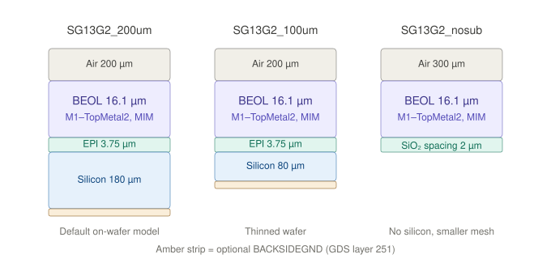
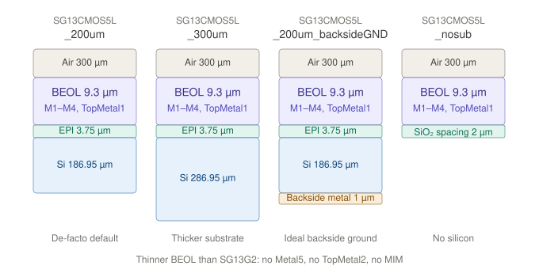

# Process stackups for the Palace EM flow

A stackup XML is what turns a GDS into a 3D model: the materials, the dielectric stack from
top to bottom, and the map from GDS layer number to a z-range. A model script names exactly
one of them.

**The files are not in this repository.** They ship with the PDK, so the stackup always
matches the `gds2palace` that reads it. This folder holds the documentation and the figures
only.

## Where they are

```
$PDK_ROOT/$PDK/libs.tech/palace/workflow/*.xml                    the production stackups
$PDK_ROOT/$PDK/libs.tech/palace/more_examples/                    resistors, thermal, format examples
$PDK_ROOT/$PDK/libs.tech/palace/doc/XML_stackup_format/           the format reference
```

`libs.tech/palace` is a git submodule of the PDK pointing at
[gds2palace_ihp_sg13g2](https://github.com/VolkerMuehlhaus/gds2palace_ihp_sg13g2), so the
version you get is whatever the PDK pins and the container installs. IIC-OSIC-TOOLS clones
the `iic-jku` fork's `dev` branch with `--recursive`, so the whole palace tree is present in
the image, `workflow/`, `more_examples/` and `doc/` alike. Since 2026-08-21 that fork pins
gds2palace 0.4.0 (reader 1.7.2), which reads every schema version below. `ihp-sg13cmos5l` has no
`libs.tech/palace` at all, which is why the SG13CMOS5L stackups below come from the SG13G2
side.

To list what your container actually has:

```sh
ls $PDK_ROOT/$PDK/libs.tech/palace/workflow/*.xml
```

## Which one SPARX uses

`SG13G2_nosub.xml`, the default of `--stackup` in `../scripts/palace_sim.py` and
`../scripts/six_port_core_palace_sim.py`. The solid Metal5 plane under the TopMetal2 traces
shields the silicon, so leaving the substrate out of the model costs almost nothing in
accuracy and saves a lot of mesh. `nosub` declares no `SUBGND`, `BACKSIDEGND` or `LBE` layer,
so those GDS layers are ignored even if they are drawn.

Both scripts print the stackup and the PDK version at startup:

```
Stackup:     /foss/pdks/ihp-sg13g2/libs.tech/palace/workflow/SG13G2_nosub.xml
PDK commit:  d592520846234ec601cd80300d7377d41340b5a5
```

Keep those two lines in the log. The stackup is the one model input this repository does not
pin, and together they identify it exactly: the PDK commit pins the `libs.tech/palace`
submodule, which is the stackup file itself. The hash comes from `$PDK_ROOT/$PDK/COMMIT`,
which IIC-OSIC-TOOLS writes when it installs the PDK, so you can also read it directly:

```sh
cat $PDK_ROOT/$PDK/COMMIT
```

To use a different stackup, pass a bare name resolved against the PDK, or any path:

```sh
python3 verification/em/scripts/palace_sim.py <gds> --stackup SG13G2_200um.xml
python3 verification/em/scripts/palace_sim.py <gds> --stackup /path/to/my_stackup.xml
```

## The production stackups

Two families, plus a PCB file that is not an IC at all.

| Family | Files | What it is |
|---|---|---|
| **SG13G2** | `SG13G2_200um`, `SG13G2_100um`, `SG13G2_nosub` | IHP 130 nm SiGe:C BiCMOS (`ihp-sg13g2`). Full BEOL: Metal1 to Metal5, TopMetal1/2, MIM. |
| **SG13CMOS5L** | `SG13CMOS5L_200um`, `SG13CMOS5L_300um`, `SG13CMOS5L_200um_backsideGND`, `SG13CMOS5L_nosub` | A different IHP PDK (`ihp-sg13cmos5l`): 130 nm plain CMOS with an M1 to M4 plus TopMetal1 stack. |
| **PCB** | `pcb_ro4003` | A 2-layer Rogers RO4003 board, εr 3.38, tanδ 0.0022. |

Within a family the files differ only in what is below the BEOL and how much air is above.

| File | Technology and BEOL | Substrate below the BEOL | Air above |
|---|---|---|---|
| `SG13G2_200um.xml` | Full SG13G2: Metal1 to Metal5, TopMetal1/2, MIM and Vmim (BEOL 16.13 µm) | EPI 3.75 µm plus Si 180 µm (200 µm total) | 200 µm |
| `SG13G2_100um.xml` | same | EPI 3.75 µm plus Si 80 µm (100 µm, thinned wafer) | 200 µm |
| `SG13G2_nosub.xml` | same | none, replaced by a 2 µm SiO2 "Spacing" (no EPI, no Si, no `SUBGND` / `BACKSIDEGND` / `LBE`) | 300 µm |
| `SG13CMOS5L_200um.xml` | 5-metal option: Metal1 to Metal4 plus TopMetal1, no Metal5, no TopMetal2, no MIM, thinner oxide (BEOL 9.3 µm) | EPI 3.75 µm plus Si 186.95 µm | 300 µm |
| `SG13CMOS5L_300um.xml` | same | Si 286.95 µm (300 µm) | 300 µm |
| `SG13CMOS5L_200um_backsideGND.xml` | same | 200 µm Si plus a 1 µm `LOWLOSS` backside metal dielectric block (ground plane on the wafer back, no GDS layer needed) | 300 µm |
| `SG13CMOS5L_nosub.xml` | same | none, 2 µm SiO2 spacing only | 300 µm |

The 100 / 200 / 300 µm numbers are modelling truncations of the silicon, not the physical
wafer thickness. With the default absorbing boundary at `zmin`, the value decides how much
lossy silicon (sigma = 2 S/m) is inside the simulation domain. A thicker value captures more
substrate loss and costs mesh and runtime.

### SG13G2 substrate variants at a glance



Cross-sections, not to scale. All three SG13G2 variants share the same BEOL. They differ only
in what sits below it and how much air sits above.

### SG13CMOS5L variants at a glance



Cross-sections, not to scale. The BEOL itself is different from SG13G2. This is a separate
PDK, which is why the two families cannot be shown in one figure.

## Beyond the production set

Under `more_examples/` in the same PDK folder:

| File | What it is |
|---|---|
| `derived_layers_and_resistors/SG13G2_resistors_200um.xml` | The full SG13G2 200 µm stackup plus `RSIL` (7 Ω/sq), `RPPD` (260 Ω/sq) and `RHIGH` (1360 Ω/sq) as sheet resistors, recognized through derived layers. schemaVersion 3.1. |
| `XML_stackup_format_examples/01..04_*.xml` | The same physical SG13G2 200 µm stackup written four times, each adding one format generation. The cleanest way to see what a 3.x attribute does. |
| `thermal_simulation_using_Elmer/SG13_interposer_thermal_typicalvalues.xml` | An Elmer thermal model for an IHP interposer. Not an EM stackup. |
| `doc/XML_stackup_format/variables_example.xml` | A small illustrative file for the expression syntax. Its derived layers do not match any real layout. |

SPARX does not use the resistor stackup. The termination resistors are excluded from the EM
model on purpose: `six_port_core_palace_sim.py` puts an in-plane Metal1 port across the gap
where the resistor sits, and the resistor is added back in the circuit simulation. If you do
want it, note it carries the full 200 µm substrate, EPI, `SUBGND`, `BACKSIDEGND` and `LBE`,
so it is a much larger mesh than `nosub` and not a drop-in swap. Override its
`total_thickness` variable from the script rather than editing the file.

## File format

```xml
<Stackup schemaVersion="2.0">
  <Variables>       <!-- optional, 3.1, must come first -->
  <Materials>
  <ELayers LengthUnit="um">
    <Dielectrics>
    <Layers>
    <DerivedLayers> <!-- optional, 3.0 -->
  </ELayers>
  <Tables>          <!-- optional, thermal only -->
</Stackup>
```

Parsed by `gds2palace/util_stackup_reader.py::read_substrate()`, which returns
`materials_list, dielectrics_list, metals_list`.

| Section | Purpose |
|---|---|
| `<Variables>` | Named numbers or strings, referenced from any other attribute as `=expression`. |
| `<Materials>` | Named materials with `Type` (`Conductor`, `Dielectric`, `Semiconductor`, `Resistor`), `Permittivity`, `DielectricLossTangent`, `Conductivity`, `Rs`, display `Color`. |
| `<Dielectrics>` | The vertical dielectric stack, ordered top to bottom, each with a `Thickness` in µm. This builds the simulation box. |
| `<Layers>` | GDS layer to physical layer: `Layer=` is the GDSII layer number, `Type=` is `conductor`, `via`, `dielectric` or `sheet`, plus `Zmin`/`Zmax` and the `Material`. |
| `<DerivedLayers>` | Layer numbers computed from other layers with `AND`/`OR`/`XOR`/`NOT`/`SIZE` instead of read from GDS. |
| `<Tables>` | Temperature to thermal-conductivity lookup curves. Elmer thermal flow only. |

`Permittivity` defaults to `1`, `DielectricLossTangent` to `0`, `Conductivity` to `0`, `Rs` to
`0`. Upstream drops these attributes wherever they equal the default, so two files that look
very different can describe the same thing. `Density`, `ThermalConductivity` and
`ThermalConductivityTable` are read only by the Elmer thermal flow and have no effect on an
S-parameter simulation.

### Special "magic" GDS layers

Layers you can draw in your layout that the stackup maps to non-PDK objects:

| Name | GDS layer | Meaning |
|---|---|---|
| `SUBGND` | 250 (SG13G2) / 210 (CMOS5L) | Ideal ground plate directly under the EPI, material `LOWLOSS` (sigma = 1e10). |
| `BACKSIDEGND` | 251 | Ideal ground plane on the wafer backside. SG13G2 files only. |
| `LBE` | 157 | Filled with `AIR` (local backside etch). Drawing it carves the silicon away. |

The `nosub` variants deliberately declare none of them.

## The three schema versions

The format grew two generations in August 2026. `schemaVersion` on the `<Stackup>` root says
which one a file uses.

| schemaVersion | Adds | Needs |
|---|---|---|
| `2.0` | The original: `<Dielectrics>` stack implicitly by `Thickness` in file order, `<Layers>` carry absolute `Zmin`/`Zmax`, and one global `<Substrate Offset="...">` shifts the whole drawn stack. | Any reader. |
| `3.0` | `Reference`/`ReferenceEdge` on `<Dielectric>` and `<Layer>`, `<DerivedLayers>`, thermal `<Tables>`. | `util_stackup_reader.py` 1.6.0 or newer. |
| `3.1` | `<Variables>` and `=`-expressions in any attribute value, plus the `variable_overrides` argument to `read_substrate()`. | `util_stackup_reader.py` 1.7.0 or newer. |

Every file in `workflow/` is still `2.0`. The 3.x ones live under `more_examples/`.

### Reference-relative positioning, 3.0

In `2.0`, `<Substrate Offset>` is a single hand-computed number whose derivation exists nowhere
in the file, and every `Zmin`/`Zmax` above a dielectric has to be recomputed by hand when that
dielectric's `Thickness` changes. In `3.0` an element names what it sits against and its
`Zmin`/`Zmax` become offsets from that edge, positive going up:

```xml
<Layer Name="Metal1" Type="conductor" Material="Metal1" Layer="8"
       Reference="Cont" ReferenceEdge="Top" Zmin="0.0000" Zmax="0.4200" />
```

A `<Dielectric>` may only reference another `<Dielectric>`. A `<Layer>` may reference either,
and chains resolve in dependency order regardless of file order. Dielectric and Layer names
share one namespace for the lookup, so a name must not exist as both, and a file must not mix
`Reference` with a nonzero `<Substrate Offset="...">`.

### Variables and expressions, 3.1

```xml
<Variables>
  <Variable Name="air_thickness" Value="200.0000" />
  <Variable Name="total_thickness" Value="200.0000" />
  <Variable Name="bulk_thickness" Value="=total_thickness-20" />
</Variables>
...
<Dielectric Name="Substrate" Material="Substrate" Thickness="=bulk_thickness" />
```

Any attribute value starting with `=` is an expression over `+ - * / **`, unary signs,
parentheses, numeric literals and bare variable names. A string variable may only be used as
the whole value, not inside arithmetic. There are no function calls. An expression used in a
GDSII layer number must resolve to an integer, otherwise it is an error rather than a silent
truncation.

A model script can override a variable without touching the file, which is the clean way to
sweep substrate thickness:

```python
materials_list, dielectrics_list, metals_list = stackup_reader.read_substrate(
    XML_filename, variable_overrides={'total_thickness': 300})
```

An override naming a variable that does not exist is an error, so a stale override fails fast
instead of doing nothing.

### Derived layers, 3.0

A derived layer needs a normal `<Layer>` entry giving it a z-range and material, plus a
`<DerivedLayer>` entry giving it geometry. `Operation` is `AND`, `OR`, `XOR`, `NOT` (two or
more operands, folded left to right, order matters for `NOT`) or `SIZE` (one operand, needs a
nonzero `Oversize`). `Oversize` can be added to any operation and is applied last. An
`<Operand>` may name another derived layer, resolved automatically in dependency order. No
change is needed in the model script: `read_gds()` picks the definitions up from
`metals_list`.

The redesign that brought derived layers also reworked cutout handling, so the
`preprocess_gds` model option is no longer required. Both SPARX scripts already set it to
`False`.

### Sheet resistors

`Type="Resistor"` materials carry `Rs` in Ohm per square and pair with a zero-thickness
`Type="sheet"` layer. Setting `Zmax` equal to `Zmin` forces `Type` to `sheet` whatever the
file says.

## Before using a 3.x file, check the reader

This is the one real trap. A reader older than 1.6.0 does not understand
`Reference`/`ReferenceEdge` and **does not warn about it**. It ignores the attributes and
reads `Zmin`/`Zmax` as absolute coordinates, so a 3.0 file meshes without any error message
and puts every referenced layer at the wrong height. You get S-parameters, not a failure. A
reader older than 1.7.0 on a 3.1 file fails loudly instead, because `Thickness="=air_thickness"`
does not parse as a float.

`gds2palace` comes from the container, and we do not pin it, so check before switching:

```sh
python3 -c "import gds2palace as g; r = g.stackup_reader; print(
  'gds2palace', getattr(g, '__version__', '?'),
  'reader', getattr(r, '__version__', '?'),
  'schema', getattr(r, 'SUPPORTED_SCHEMA_VERSION', 'pre-3.x'))"
```

`SUPPORTED_SCHEMA_VERSION` only exists from reader 1.6.0, so `pre-3.x` in that last field
means the reader predates the whole format and every `Reference` is about to be misread.
gds2palace 0.4.0 ships reader 1.7.2 and handles everything.

## How to choose

- Transmission lines, baluns, couplers, and anything else with a solid ground plane
  underneath: use `nosub`. The ground shields the silicon, so removing it costs almost nothing
  in accuracy and saves a lot of mesh. This is what all four SPARX structures do.
- Inductors, MIM caps, and anything where substrate loss or coupling matters: use `200um`, or
  `100um` for a thinned wafer.
- Add `SUBGND` / `BACKSIDEGND` / `LBE` polygons to your GDS only if the chosen stackup
  declares those layers.

## One inconsistency worth knowing

In the SG13G2 files `LBE` is declared `Type="dielectric"` and `SUBGND` / `BACKSIDEGND` are
`Type="conductor"`. In the older CMOS5L files `LBE` and `SUBGND` are both `Type="via"`, with
`LBE` carrying material `AIR`. The reader supports both, but the SG13G2 form is the cleaner
one to copy if you write your own stackup.

## Upstream documentation

- Format reference: [`XML_stackup_format.md`](https://github.com/VolkerMuehlhaus/gds2palace_ihp_sg13g2/blob/main/doc/XML_stackup_format/XML_stackup_format.md)
- How the format grew: [`evolution_of_stackup_file_format.md`](https://github.com/VolkerMuehlhaus/gds2palace_ihp_sg13g2/blob/main/doc/XML_stackup_format/evolution_of_stackup_file_format.md)
- Derived layers: [`derived_layers.md`](https://github.com/VolkerMuehlhaus/gds2palace_ihp_sg13g2/blob/main/doc/XML_stackup_format/derived_layers.md)
- Change log: [`doc/CHANGES.md`](https://github.com/VolkerMuehlhaus/gds2palace_ihp_sg13g2/blob/main/doc/CHANGES.md)
- GUI stackup editor: [setupEM](https://github.com/VolkerMuehlhaus/setupEM), `Tools > Edit Stackup XML...`, or `stackupEditor <file>.xml` standalone
